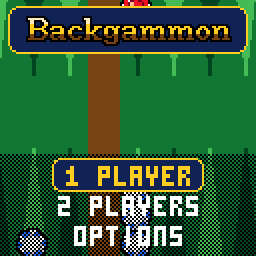

> RPGame 0.3 port: RP2350 RISC-V. Use the [project setup](../../README.md) for builds, wiring and SD packages. The upstream notes below retain CH32 sizes, timings and tool commands as historical context.

# CHBackgammon

Throw the dice, carry your chips round the board with a pointing glove, knock blots to the bar and bear off before Red does. It is the casino's third table: green felt seen from above, a doubling cube, a hint when you want one, and a CPU opponent that learned the game by playing itself.

## Controls

| Button | Action |
|---|---|
| A | Throw the dice (on the cube: double); pick a checker up and set it down; pick the dice up to end your turn; select |
| D-pad | Move the glove between your points or, holding a checker, between the places it can go: LEFT and RIGHT to the next one along the same half of the board (round to the far end), UP and DOWN across to the nearest on the other half; before you throw, between the dice and the cube; menus |
| B | Put the checker back; with an empty hand, take your last move back; back |
| SELECT | A hint: the best play of your roll, and your chances |
| START | Pause: resume, resign, save and quit |

## Rules

- You are White: your checkers travel from the top right, round the left end of the board, to your home board at the bottom right, and off into the tray beside it. Red goes the other way round. The first to bear off all fifteen wins.
- Each die moves one checker that many points; a double is played four times. A checker may land on any point that does not hold two or more of the other side's.
- A single checker is a blot: land on it and it is hit, and goes to the bar. A side with a checker on the bar must enter it before moving anything else.
- You must play both dice if you can, and the higher if only one can be played. With no move at all the turn passes (NO MOVES, or DANCE! when you are stuck on the bar).
- You bear off once all your checkers are in your home board.
- In a match a game is worth the doubling cube's value, twice that for a gammon and three times for a backgammon. Refusing a double gives the doubler what the cube showed before. When a side first needs just one point, the next game is the Crawford game, played without the cube.
- With BEAVERS on (a house rule: tournaments play matches without it), a side that is doubled may beaver: take, and at once redouble, keeping the cube. The doubler cannot refuse, but may raccoon: redouble again and take the cube back.

## How to play

**1 PLAYER** puts you against the CPU; **2 PLAYERS** pass the handheld between White and Red. Choose the opponent on the setup screen:

| Opponent | How it plays |
|---|---|
| BEGINNER | Still learning: plays any of its best few plays |
| EXPERT | Its best play, every roll |
| GRANDMASTER | Looks a roll ahead: every roll you could throw next, and your best answer to it |

A single game without the cube is the default; a match to 3, 5 or 7 points brings the cube in. It sits on the bar showing 64: before you throw, move the glove from the dice to the cube and press A to double; doubled yourself, choose TAKE or PASS (or BEAVER, with beavers on; beavered, TAKE or RACCOON). The CPU uses the cube too, and beavers and raccoons when it likes its game.

On your turn the glove stops on your points, and a checker you pick up lights the places it can go: a point for each die and for both together, pulsing red where it would hit. A plate at the foot of the screen names what the glove is on, and plays are called in the notation players use ("24/18* 13/11", "8/5(2)"). Nothing is final until you pick the dice up: until then B takes moves back, hits and all.

SELECT shows the best play of your roll and your chances.

The dice are the same for everyone: one generator, seeded from the moment you press the button, that the CPU cannot see or touch. OPTIONS has sound, the felt (green, blue, red, purple), HOME LEFT to mirror the board, the pace (FUN, or QUICK: no close-ups and shorter pauses), AUTO and BEAVERS. With AUTO on (the default) the dice are thrown for you when there is no cube to decide on, and a roll that allows only one play, such as most of a bear-off, is played for you. Options, your record against each opponent (hold SELECT on that screen to clear it) and a game or match in progress (SAVE + QUIT, then CONTINUE) are saved.

To put it on the handheld: in the Arduino IDE, with the CHGame board package installed ([Installing](https://github.com/bateske/CHGame#installing)), open it from *File > Examples > CHGame > Games*, set *Tools > USB* to **Upload only** and upload; from a clone of the repository, `chgame upload` in this folder. On a card for the game menu it is in the release's SD card zip.

## Developer notes

- **A neural network in 3.2 KB of integers.** `Net.cpp` evaluates 196 inputs through 16 hidden units with 8-bit weights, integer adds and a sigmoid table, no floating point. `tools/train` taught it by self-play, the way TD-Gammon learned, compiling the game's own rules and evaluator so the network measured on the PC is the one on the handheld.
- **Incremental evaluation from SRAM.** Consecutive plays differ by a checker or two, so the network keeps its hidden sums and adds or removes only the rows that changed; it and the move generator in `Rules.cpp` are `RAMFUNC`.
- **Thinking in slices.** `Match.cpp` gives the CPU 64 positions a tick (`QUANTUM`), so the frames never stop, no second stack is needed, and the tests check its choice is the same however the work is sliced.
- **A camera that scales by fifths.** `Table.cpp` draws the board in world units a row at a time, 1x to 2x, and `render()` in `Stage.cpp` returns false for a still board: the frame is sent again and the palette effects keep moving for free.
- **Fitting the flash.** A 32-bit division instead of a 64-bit one in `Cube.cpp` saved 1.2 KB of library code; the display font in `Font.cpp` is found by walking its glyphs instead of an index.
- More in [NOTES.md](NOTES.md): how it fits, design decisions, tests, the script commands and open items.

## Credits

Apache License 2.0; see `LICENSE` and `NOTICE`. The code, the CPU, its match equity table and the display font are this project's own, on the framework of CHBlackjack (Apache-2.0) by way of CHChess, with CHChess's pointing glove. CHBlackjack is a derivative of "Blackjack" for the Arduboy by Press Play On Tape (Apache-2.0); the 3x5 font is Press Play On Tape's.
