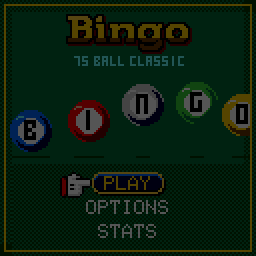

> RPGame 0.3 port: RP2350 RISC-V. Use the [project setup](../../README.md) for builds, wiring and SD packages. The upstream notes below retain CH32 sizes, timings and tool commands as historical context.

# CHBingo

Buy up to nine cards and race a hall of rivals to the first line, while the dealer from the Blackjack tables calls the balls. Every card has to be daubed on its own and the screen only shows one and a half of them, so the game is swiping: get to the card with the rainbow frame and press A before somebody across the hall shouts first.

## Controls

| Button | Action |
|---|---|
| LEFT / RIGHT | Swipe to the previous / next card (hold to run); fewer / more cards at the buy-in; change an option |
| UP / DOWN | More / fewer cards at the buy-in; move in the menus |
| A | Daub every called number waiting on the card in play; buy in; select |
| B | Use the power-up; back |
| START | Pause: resume, the called board, options, save and quit |

## Rules

75-ball bingo: 5x5 cards, B 1-15, I 16-30, N 31-45, G 46-60, O 61-75, the centre free. The first complete row, column or diagonal wins.

- **Cards.** You buy one to nine cards a round, $5, $10 or $25 each. You start with $500 and play until you are broke.
- **Daubing.** A called number only counts once it is daubed, and each card is daubed on its own: swipe to it and press A. A card with a number waiting has a rainbow frame, and so has its pip in the bar at the foot of the screen, which tells you which way to swipe. Numbers you missed stay daubable. The glove points at the next number waiting on the card in play, or across at the next card when the waiting numbers are elsewhere. Pressing A with nothing waiting buzzes and ends your streak. Completing a line with a daub is the call: BINGO!
- **The hall.** 8, 20 or 40 rival cards play the same draw. When one of them completes a line you still have until the next call to daub a line of your own; after that the round is theirs.
- **The pot** is 90% of what the whole hall paid for its cards, so more cards cost more, win more often, and are harder to keep up with.
- **Power-ups.** Daubs fill the POWER meter, and a daub within a second of its call fills it faster and builds a streak. When it is full you are handed one of three, used with B:

| Power-up | What it does |
|---|---|
| WILD | Daubs the open cell nearest to finishing a line on the card in play |
| FREEZE | Holds the caller for two calls' time |
| 2X POT | Doubles the pot if that card wins |

- **The jackpot** grows by 5% of every buy-in and pays, on top of the pot, for a bingo within the first ten calls: about one round in 135 with nine cards played perfectly, one in 1,250 with one card.

## How to play

**PLAY** opens the buy-in: pick how many cards, press A, and the caller starts. A round ends with your bingo or a rival's, and the next buy-in follows; play is endless until the purse is empty. Now and then the banner comes up as "IT'S A BINGO!", and the dealer has something to say about that.

**OPTIONS** has the stakes, the hall's size, how fast the balls come (a call every 2 seconds; 1.3 on FAST, 3 on SLOW), sound, the caller's look and your dauber's colour (red, blue, green, cyan or peach: the daubs, their splat and the glove's cuff all wear it).

Options, lifetime statistics, the jackpot and a game in progress, the round being played included, are saved and survive re-uploading: SAVE & QUIT from the pause menu, then CONTINUE. **STATS** shows the lifetime numbers; hold SELECT there to reset them.

To put it on the handheld: in the Arduino IDE, with the CHGame board package installed ([Installing](https://github.com/bateske/CHGame#installing)), open it from *File > Examples > CHGame > Games*, set *Tools > USB* to **Upload only** and upload; from a clone of the repository, `chgame upload` in this folder. On a card for the game menu it is in the release's SD card zip.

## Developer notes

- **A hall that costs no RAM.** At the start of a round `Bingo.cpp` shuffles the draw, deals each rival card, reduces it to the call on which it completes a line and throws it away; only the earliest of those calls is kept.
- **A saved round is a seed.** `Save.cpp` stores the round's seed and the daubs in the library's two flash save pages; the draw, the cards and the hall are dealt again from the seed.
- **Animation through the palette.** The frame of a card with a number waiting, its pip (`Cards.cpp`) and the winning line are drawn in one palette entry that cycles through the rainbow, so nothing is redrawn to animate them.
- **Redraws by band.** `Presenter.cpp` redraws the wall, the plaque, the felt and the bar only when what they show changes or something moving touches them; `chgame redraw` checks every frame against a full redraw.
- **Rules without graphics.** `Bingo.*` has no drawing and no sound, so the host tests in `tools/tests` play thousands of rounds and check the set-up against an independent Python model.
- More in [NOTES.md](NOTES.md): design decisions, tests, the script commands and open items.

## Credits

Apache License 2.0; see `LICENSE` and `NOTICE`. The caller is Press Play On Tape's dealer from "Blackjack" for the Arduboy (Simon Holmes (filmote), code; Stephane C (vampirics), art; Apache-2.0), recoloured and retouched by hand, by way of CHBlackjack; the "YOU ARE BROKE" lettering and the 3x5 font are Press Play On Tape's too. The shared core, the table's wall and rail and the tools come from CHBlackjack by way of CHRoulette, whose screens, presenter structure and redraw check this game started from; the "Bingo" title's B is CHBlackjack's and its o CHRoulette's. The pointing glove, the soft clock ticks and the shake routine are from CHChess. All three are Apache-2.0.
