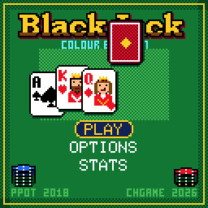

> RPGame 0.3 port: RP2350 RISC-V. Use the [project setup](../../README.md) for builds, wiring and SD packages. The upstream notes below retain CH32 sizes, timings and tool commands as historical context.

# CHBlackjack

Take $500 to the table and break the bank before the bank breaks you: bet, hit, stand, double and split against a dealer who talks, blinks and deals from a six-deck shoe. It is Press Play On Tape's Arduboy Blackjack, rebuilt in colour.

## Controls

| Button | Betting | Your turn | Elsewhere |
|---|---|---|---|
| LEFT / RIGHT | Choose a chip, DEAL or CLR | Choose HIT / STAND / DOUBLE / SPLIT | Menus |
| A | Add the chip (hold to repeat), deal, clear | Do it | Select |
| B | Take that chip back | Dismiss the dealer's speech | Back |
| UP / DOWN | Add / remove the chip | UP hits, DOWN stands | Menus; insurance amount |
| START | Pause: resume, options, save and quit | Pause | |
| SELECT | Mute | Mute | Hold on Stats to reset them |

## Rules

Get closer to 21 than the dealer without going over. Aces count 1 or 11, court cards 10.

| | Casino (default) | Classic (Press Play On Tape's rules) |
|---|---|---|
| Cards | Six-deck shoe with a cut card and a visible shuffle | One deck, reshuffled every hand |
| Dealer | Stands on all 17s | Draws while his hard total is 16 or less, so he hits soft 17-20 |
| Dealer peeks for blackjack | Under an ace or a ten | Only under an ace |
| Blackjack | Pays 3:2 and beats a three-card 21 | Pushes against 21 |

In both:

- Bets are $1, $5, $10 and $25 chips, up to $200.
- Split one pair of equal rank; split aces get one card each.
- Double on any two cards, including after a split.
- Insurance, offered under a dealer's ace, pays 2:1.

## How to play

Start with $500 and reach the goal ($1000 by default) before you go broke. Your last bet is placed again for you each hand; CLR or B takes it back. CONTINUE on the title screen picks up a saved game. Leave the title screen alone and, once its tune has played through, a demo game plays itself at a pace you can follow.

OPTIONS has the rules, the goal ($1000, $5000 or endless), speed, sound (lead: the tune as single notes; arpeggio: melody and accompaniment taking turns; off), felt colour (green, blue, red, purple), a two- or four-colour deck, hand totals on or off, and a second dealer look. Options, lifetime statistics and your purse are saved to flash and survive re-uploading the game.

STATS shows the lifetime figures: hold SELECT for a second and a half to reset them, or press A for the credits page in the casino's back room.

To put it on the handheld: in the Arduino IDE, with the CHGame board package installed ([Installing](https://github.com/bateske/CHGame#installing)), open it from *File > Examples > CHGame > Games*, set *Tools > USB* to **Upload only** and upload; from a clone of the repository, `chgame upload` in this folder. On a card for the game menu it is in the release's SD card zip.

## Developer notes

- **Rules with no graphics.** `Round.cpp` is the whole game flow and includes nothing from the library but the button masks, so `tools/tests/test_rules.cpp` runs it on the PC: every payout, and a 16,000-hand fuzz that checks money is conserved.
- **Events become motion.** The rules emit events and `Presenter.cpp` turns them into card flights, flips and chip payouts, so the animation never holds up the logic.
- **Band-level redraw.** The framebuffer survives between frames, so `Presenter.cpp` redraws only the bands (wall, felt, button bar) that changed or that something moving touched. Every frame is still flushed, which makes the palette effects (the rainbow BLACKJACK!, the felt colour option) free.
- **Art stored as differences.** `tools/assets.py` keeps the dealer's normal face as a patch and every other expression as only the pixels that differ.
- **A/B saves in shared flash pages.** `Save.cpp` says what a save holds; the library's `chgame/Save.h` keeps it in two pages with a sequence number and CRC, so a power cut mid-save loses nothing.
- More in [NOTES.md](NOTES.md): design decisions, how it fits, tests, the script commands and open items.

## Credits

Original game by [Press Play On Tape](https://github.com/Press-Play-On-Tape/Blackjack): **filmote** (Simon Holmes, code) and **vampirics** (Stephane C, art). Apache-2.0, like this port (CHBlackjack, copyright 2026 bateske); see `LICENSE` and `NOTICE`, which lists what this port changed.
