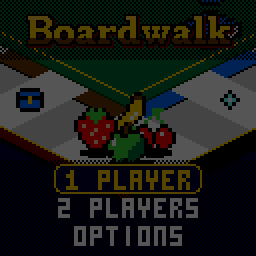

> RPGame 0.3 port: RP2350 RISC-V. Use the [project setup](../../README.md) for builds, wiring and SD packages. The upstream notes below retain CH32 sizes, timings and tool commands as historical context.

# CHBoardwalk

Roll round the classic Atlantic City streets, buy deeds, build houses and tap to outbid the table in auctions against the clock. It is the property game played arcade style on an isometric casino table: one player against the CPU, or two on one handheld, and over in minutes.

## Controls

| Button | Action |
|---|---|
| LEFT / RIGHT | Choose a button on the bar at the foot of the screen: ROLL, MANAGE (BUILD when there is a house to be had), BUY, AUCTION, and in jail PAY $50 or CARD |
| A | Press the chosen button; answer a card or a PRESS A; bid in an auction |
| SELECT | The map: the whole board from above, who owns what, everyone's cash and net worth |
| START | Pause: resume, options, save + quit; it shows the round and closing time |
| In MANAGE | LEFT / RIGHT walk your deeds, UP builds a house, DOWN sells one back at half price, A auctions the deed, B goes back |
| In an auction | Each person has a button to tap: the first **A**, the second the **D-pad**, then **B**, then **SELECT** |

## Rules

The rules are the ones you know, in the short game's shape:

- Everyone starts with $1500 and a few deeds, dealt free: four each with two players, two each with more.
- Roll, move, and collect $200 passing GO, or **payday**, $400, for landing on it with the dice. Doubles roll again; three running go to jail. In jail, pay $50, play a card, or roll for doubles (the third miss pays and moves).
- Land on an unowned deed and BUY it at its price, or send it to AUCTION. Land on someone's and pay the rent on its card; a full colour set doubles the bare rent, railroads pay by how many, utilities by the dice.
- Hold **most of a colour group** (two of its three streets, or both of a pair) and BUILD houses on what you hold, evenly, and a hotel after four. The table calls CAN BUILD! when a deed gives you most of a group, FULL SET! when it gives you all of it.
- **There is no trading. There are auctions.** A deed the lander turns down starts at nothing: the first tap leads at $0 and each tap after raises it a step. Every bid restarts the clock (GOING ONCE, GOING TWICE), and when it runs out the lot is SOLD to whoever leads; unbid, it goes free to the next seat.
- From MANAGE you can put a deed of your own up for auction. The bank opens at half its price, so that is the least you get. It is the only way a deed changes hands, and the way to raise cash.
- A debt you cannot pay is settled for you: houses go back at half price, then your deeds go to auction, strays first. If that is still not enough, you are bankrupt.
- **The jackpot:** taxes, fines and bail pile up on Free Parking, where the pot floats over its corner, and go to whoever lands there.
- The game ends at the **first bankruptcy**, or at **closing time**. The richest player left (cash, deeds at their price, buildings at cost) wins.

## How to play

**1 PLAYER** is you against a CPU; **2 PLAYERS** is the two of you, passing the handheld. Either way THE TABLE comes up set and A deals. It can seat up to four, each a person or a CPU (EASY, FAIR or SHARK), and sets closing time: 10 to 60 rounds, 20 to begin with. A CPU's turn goes by quickly: the show is for your own.

BUILD opens MANAGE on a street you can build on, and each UP moves along the set, so UP, UP, UP builds it up evenly. Under the card, THEY PAY is what the others pay to land there as it stands. Landing on any owned deed, the plate at the foot of the screen names its owner and what it charges. With four at the table the round floats up as each round begins.

The result draws everyone's worth round by round: the story of the game.

OPTIONS has sound on or off, and the pace: FUN, or QUICK (faster turns, no zooming in on landings). Options, the house's records and a game in progress (SAVE + QUIT, then CONTINUE, which picks the game up as that turn began) are saved to flash and survive re-uploading.

To put it on the handheld: in the Arduino IDE, with the CHGame board package installed ([Installing](https://github.com/bateske/CHGame#installing)), open it from *File > Examples > CHGame > Games*, set *Tools > USB* to **Upload only** and upload; from a clone of the repository, `chgame upload` in this folder. On a card for the game menu it is in the release's SD card zip.

## Developer notes

- **Rules with no graphics.** `Game.cpp` is a phase machine that reports events (dice, moves, payments, bids) and waits while `Stage.cpp` is busy showing them; only the auction runs on the clock. That is why the host tests can play 5,000 games through it.
- **An isometric board at every zoom.** `Iso.cpp` draws a 13 x 13 lattice of 2:1 diamonds sampled at pixel centres, so every edge is a clean staircase at each zoom step. The ring is two cells deep, and pink and orange are dithered from the sixteen colours.
- **One sprite, two sizes.** The art is span-encoded (`src/assets/Assets.h`) and drawn by the library's `sprite4` through a palette remap and a scale: as drawn at rest, doubled when the camera whips in (`iso::zscale()`), never stretched in between. The glove is gold-cuffed for you and red for a CPU by remap alone.
- **Text that is built, not stored.** In `Text.cpp` the tile names share their endings (AVENUE, PLACE, RAILROAD, TAX) and each card's wording comes from its effect.
- **A whole game in one save record.** `Save.cpp` says only what the record holds; the pages, CRC and A/B copies are the CHGame library's.
- More in [NOTES.md](NOTES.md): design decisions, tests, the script commands, the art sheet and open items.

## Credits

Apache License 2.0; see `LICENSE` and `NOTICE`. Copyright 2026 bateske. Adapted from CHChess and CHBlackjack (both Apache-2.0); CHBlackjack is a derivative of "Blackjack" for the Arduboy by Press Play On Tape (Apache-2.0), and the 3x5 pixel font in the CHGame library is Press Play On Tape's.

This is an independent game. It is not affiliated with or endorsed by the makers of any commercial board game.
