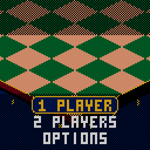

> RPGame 0.3 port: RP2350 RISC-V. Use the [project setup](../../README.md) for builds, wiring and SD packages. The upstream notes below retain CH32 sizes, timings and tool commands as historical context.

# CHCheckers

Point the glove at a chip, jump the house's pieces and stack them on your tray. Checkers on CHChess's isometric casino table, with the show turned up: multiple jumps escalate (DOUBLE! TRIPLE! RAMPAGE!), a crown slams down on a new king, and the winning blow stops the clock.

## Controls

| Button | Action |
|---|---|
| D-pad | Move the glove between your pieces or, holding one, between the squares it can go to; menus |
| A | Pick up the piece / put it down there; select |
| B | Put the piece back; back |
| B held (+ D-pad) | Inspect: the camera zooms right in and the D-pad pushes the view around until you let go |
| SELECT | Change view: the board, or the map from above |
| START | Pause: resume, undo, resign, save and quit |

## Rules

- White moves first, up the board. Men step one square diagonally forwards.
- A man jumps an enemy piece next to it onto the empty square beyond, and the jumped piece comes off at once. A piece that can jump again must carry on.
- A man that reaches the far row becomes a king, which moves and jumps backwards too. A man crowned by a jump stops there.
- You win by taking every enemy piece or leaving them none that can move.
- Forty moves each without a jump or a man moving, or the same position three times, is a draw.

RULES on the setup screen changes the house rules for the next game (the defaults, American checkers, are in bold):

| | | |
|---|---|---|
| JUMPS | **FORCED** | A jump must be taken when there is one |
| | FREE | Jumping is your choice (a jump once begun is still finished) |
| KINGS | **SHORT** | Kings step one square |
| | FLYING | Kings slide any distance, take a piece from afar and land on any empty square beyond it |
| MEN | **AHEAD** | Men only jump forwards |
| | ANY WAY | Men jump backwards too (they still only step forwards) |

There is no rule about taking the most pieces.

## How to play

**1 PLAYER** puts you against the house; **2 PLAYERS** pass the handheld. Pick the opponent:

| Opponent | How it plays |
|---|---|
| TOURIST | Just here for the buffet: looks a move or two ahead and often picks a second-best move |
| DEALER | Knows every trick |
| THE HOUSE | Its best move, every time |

Setup keeps your record against each (hold SELECT there to wipe it), and a rematch swaps sides.

The glove only stops on your own pieces or, holding one, on the squares it can go to: cyan for a slide, red for a jump. A plate at the foot of the screen names what it is on and calls out each move as it lands (*MAN TAKES 3 ON G7 = KING*). When you have to jump, the pieces that can are ringed; the others say MUST JUMP and buzz. In the middle of a multiple jump the piece stays in your hand: with one way on it goes by itself, with a choice you pick the square.

The top line shows whose turn it is and the tally: the chips you have taken, then the chips you have lost, the same chips that pile up on the two trays beside the board. Save and quit from the pause menu and CONTINUE from the title; a saved game keeps the rules it was started with.

OPTIONS has SOUND, BOARD (the felt's colour), MUSIC (the title's tune) and PACE: FUN is the full show, QUICK drops the camera's dive on every move and hurries the CPU's hand.

To put it on the handheld: in the Arduino IDE, with the CHGame board package installed ([Installing](https://github.com/bateske/CHGame#installing)), open it from *File > Examples > CHGame > Games*, set *Tools > USB* to **Upload only** and upload; from a clone of the repository, `chgame upload` in this folder. On a card for the game menu it is in the release's SD card zip.

## Developer notes

- **Frames from inside the search.** While the CPU thinks, `Engine.cpp` calls a poll hook every 32 nodes (`frame::thinkPoll()`) and `Frame.cpp` draws a frame on a 1 KB stack of its own, so the camera, the pointing glove and the particles keep moving.
- **An engine made of steps.** The board is the 32 dark squares in a padded row and a multiple jump is several single steps with the turn staying on the piece; the alpha-beta search deepens within a node budget. `Match.cpp` stores undo and saved games as a snapshot plus one byte per step.
- **An isometric board from integer scaling.** `Iso.cpp` draws the table, the camera's dive and the flat map; art scales in whole multiples (`ascale()`, `sized()`, `zoomed()` in `Iso.h`).
- **The show is a few counters.** Slow motion on a combo's last hop and the winning capture is one multiplier (`slowF` in `Stage.cpp`); the banners, flying chips and trays are there too.
- **A title that plays itself.** The attract game is a move list in `src/states/DemoLine.h`, found by `tools/tests/demo_line.cpp`, and the tune in `Sounds.cpp` is played by the library's piezo sequencer.
- More in [NOTES.md](NOTES.md): design decisions, tests, the script commands and open items.

## Credits

Apache License 2.0; see `LICENSE` and `NOTICE`. The rules and the CPU are this game's own (`Engine.*`). The isometric board, camera, glove and play screen are adapted from CHChess, and the shared core from CHChess and CHBlackjack (both Apache-2.0). CHBlackjack is a derivative of "Blackjack" for the Arduboy by Press Play On Tape (Apache-2.0); the 3x5 font is Press Play On Tape's.
