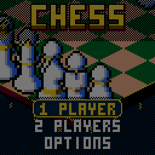

> RPGame 0.3 port: RP2350 RISC-V. Use the [project setup](../../README.md) for builds, wiring and SD packages. The upstream notes below retain CH32 sizes, timings and tool commands as historical context.

# CHChess

Play chess on an isometric board with a pointing glove: pick a piece up, see where it can go, and set it down as the camera whips in close. It is dressed in the casino style of [CHBlackjack](../CHBlackjack), with captures in slow motion and a CPU opponent that moves its pieces with a red glove of its own.

## Controls

| Button | Action |
|---|---|
| D-pad | Move the glove between your pieces or, holding one, between the squares it can go to; move in the menus |
| A | Pick up the piece; put it down there; select |
| B | Put the piece back; back |
| B held (+ D-pad) | Inspect: the camera zooms right in, and the D-pad pushes the view to the board's edges and corners |
| SELECT | Change view: the board, or the map (from above) |
| START | Pause: resume, undo, resign, save and quit |
| Any button | Answer CHECK! or CHECKMATE! |

## Rules

- The rules of chess, in full: castling, en passant, and promotion to a piece you pick from a panel.
- Checkmate wins. Stalemate, fifty moves without a capture or a pawn move, a repeated position and too little material to mate are draws.
- Only legal moves are offered. In check, the glove stops only on the pieces that can get you out of it.

## How to play

**1 PLAYER** puts you against the CPU. Choose your side and one of three opponents:

| Opponent | How it plays |
|---|---|
| BEGINNER | Still learning the moves: picks any move not much worse than the best. |
| EXPERT | Punishes mistakes. |
| GRANDMASTER | Its best move, every time. |

The weaker opponents choose at random among moves within a margin of the best one, so they make human-looking mistakes and not random blunders. Your record against each is on the opponent screen (hold SELECT there to clear it). **2 PLAYERS** pass the handheld between White and Black.

The glove steps to the nearest spot in the direction you press, as the screen shows it, and wraps round when there is nothing that way. A plate at the foot of the screen names what it is on (*KNIGHT G1*, *KNIGHT TO F3*, *KNIGHT TAKES PAWN*), then calls out each move as it lands. A piece with no moves says *NO MOVES* and buzzes. During your turn the other side's last move is lit in gold. Holding a piece, B held fills a bar under the top line first: let go before it is full and the piece goes back.

Check is an event: *CHECK!* stays up until you press a button, the king's square marches red and the king beats red until you pick it up.

OPTIONS has sound on or off, the board colour (green, blue, red or purple felt), and PACE: QUICK makes the CPU's turns and the moves faster and drops the zoom on them. Options, records and a game in progress (SAVE + QUIT, then CONTINUE) are saved to flash and survive re-uploading.

To put it on the handheld: in the Arduino IDE, with the CHGame board package installed ([Installing](https://github.com/bateske/CHGame#installing)), open it from *File > Examples > CHGame > Games*, set *Tools > USB* to **Upload only** and upload; from a clone of the repository, `chgame upload` in this folder. On a card for the game menu it is in the release's SD card zip.

## Developer notes

- **A blocking search that still draws.** The engine in `ch2k.hpp` runs synchronously and calls back every 8 nodes (`Engine.cpp`). `Frame.cpp` uses those calls to draw: the search runs flat out, with a bobbing glove every 133 ms and a short burst of full-rate frames every two seconds, drawn on a stack of their own.
- **An isometric board at every zoom.** `Iso.cpp` draws the squares as 2:1 diamonds sampled at pixel centres, so every edge is a clean staircase from 20x10 tiles to 40x20, and its span loops are `RAMFUNC`s.
- **One set of pieces, two sides.** The pieces are span-encoded sprites packed by `tools/assets.py`, recoloured for each side by a palette swap (`tools/art/sides.txt`) and scaled as the camera zooms (`Stage.cpp`).
- **Undo and saved games by replay.** `Match.cpp` replays the move list from the start, or from a snapshot in long games, which also keeps the opening book and the repetition rule right.
- **A background sound.** The CPU's clock in `Sounds.cpp` is played on a narrow pulse, so it stays behind the knocks and fanfares of the piezo sequencer.
- More in [NOTES.md](NOTES.md): design decisions, tests, the script commands and open items. What the game taught about the platform is in [docs/CH32SerialBoot-notes.md](docs/CH32SerialBoot-notes.md) and [docs/CHGfx-notes.md](docs/CHGfx-notes.md).

## Credits

Apache License 2.0 (`LICENSE`), except `ch2k.hpp`, which is MPL-2.0 (`LICENSE.MPL-2.0`); see `NOTICE`. The rules and the CPU are the ch2k engine from [ArduChess](https://github.com/tiberiusbrown/arduchess) by Peter Brown (tiberiusbrown), MPL-2.0, with the changes listed at the top of the file. The look and the shared code come from CHBlackjack (Apache-2.0), a derivative of "Blackjack" for the Arduboy by Press Play On Tape (Apache-2.0); the 3x5 font is Press Play On Tape's.
