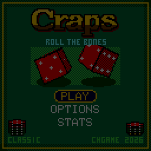

> RPGame 0.3 port: RP2350 RISC-V. Use the [project setup](../../README.md) for builds, wiring and SD packages. The upstream notes below retain CH32 sizes, timings and tool commands as historical context.

# CHCraps

Put your chips on the layout, hold A to shake the dice and let go to throw them down the table, where two 3D dice bounce off the back wall and settle. Blackjack's dealer works the table as the stickman and calls every roll: "YO-LEVEN! FRONT LINE WINNER", "SEVEN OUT! LINE AWAY".

## Controls

| Button | Action |
|---|---|
| D-pad | Move between the spots on the layout, and down into the chip rack and ROLL |
| A | Put a chip on the spot (hold to keep adding); on a rack chip, pick that chip |
| A on ROLL | Hold to shake the dice, let go to throw |
| B | Take a chip back; hold to take the whole bet down. While shaking: put the dice down. While they tumble: skip to the end |
| SELECT | Next chip ($1, $5, $25, $100) |
| START | Pause: resume, options, sound, save and quit |
| A / B during the payout | Hurry the dealer up |

## Rules

- The shooter must bet the PASS LINE or DON'T PASS before the come-out roll.
- On the come-out, 7 or 11 wins the pass line, and 2, 3 or 12 (craps) loses it.
- Any other number becomes the **point**: the puck turns over and marks that number's box.
- The shooter then rolls until the point comes again (the pass line wins) or a 7 (**seven out**: the line loses, and a new shooter comes out).
- Make two points in one hand and the shooter is **hot**: the dice burn.

| Bet | Wins | Pays |
|---|---|---|
| Pass line | come-out 7/11, then the point before a 7 | 1:1 |
| Don't pass | come-out 2/3 (12 is a push), then a 7 before the point | 1:1 |
| Odds (behind the pass line) | the point before a 7 | true odds: 2:1 on 4/10, 3:2 on 5/9, 6:5 on 6/8 |
| Lay (behind don't pass) | a 7 before the point | 1:2, 2:3, 5:6 |
| Come | like a pass bet, starting with the next roll; it moves to its number (odds can go on it) | 1:1 |
| Field | one roll: 3, 4, 9, 10, 11 | 1:1; 2 pays double, 12 triple |
| Place 4/5/6/8/9/10 | the number before a 7 | 9:5, 7:5, 7:6 |
| Hard 4/6/8/10 | the number as a pair before a 7 or the easy way | 7:1 (4, 10), 9:1 (6, 8) |
| Any 7 / Any craps / Yo | one roll: 7 / 2, 3 or 12 / 11 | 4:1 / 7:1 / 15:1 |

As in a casino:

- Place bets, hardways and come-bet odds are **off on the come-out**: they stay on the layout dimmed.
- The pass line and come bets on their numbers are contract bets: once they are working they cannot come down. Don't pass can come down but not go up.
- Winners stay up; only the winnings come home.
- Payouts are rounded down to the dollar: bet place 6 and 8 in sixes, and the odds on 5 and 9 in twos, to be paid in full.

## How to play

You start with $500. The plaque on the wall names the spot under the cursor: what it pays, what is on it, and OFF when that bet is not working this roll. The board to its right shows the last roll as two dice and the totals before it. If something cannot be done, the stickman says why ("COME OPENS AFTER THE POINT", "TABLE MAX IS $500").

OPTIONS:

- **TABLE:** CLASSIC has every bet above. BEGINNER keeps only the pass line, don't pass, their odds, the field, and place 6 and 8, on a roomier layout.
- **ODDS:** how much odds you may take behind the line: 2X, 3-4-5X (3x the line bet on 4/10, 4x on 5/9, 5x on 6/8) or 10X.
- **GOAL:** $1000, $5000 or endless. Reach it and you have broken the bank; run out and you are broke.
- **SPEED** normal or fast, **FELT** green, blue, red or purple, **SOUND** on or off.

STATS keeps rolls, points made, seven-outs, the longest hand, hardways hit, the best purse, the biggest win, banks broken and times broke (hold SELECT there to reset them). The options, the stats and the table as it stands are saved: SAVE & QUIT, then CONTINUE, puts you back mid-hand.

To put it on the handheld: in the Arduino IDE, with the CHGame board package installed ([Installing](https://github.com/bateske/CHGame#installing)), open it from *File > Examples > CHGame > Games*, set *Tools > USB* to **Upload only** and upload; from a clone of the repository, `chgame upload` in this folder. On a card for the game menu it is in the release's SD card zip.

## Developer notes

- **3D dice in integer maths.** `Dice3D.cpp` rotates each die with the CHGame library's sine table (`fx::isin`), projects it through a tilting pinhole camera, culls back faces and fills the rest with a scanline polygon fill. Physics steps once per 60 Hz tick.
- **The dice do not decide the roll.** The rules roll first; the throw is deterministic, so it is simulated ahead and each die is relabelled (`labelDie`) so that the face that lands on top shows the rolled number. All 24 orientations come from one walk of quarter turns held in a 24-bit constant.
- **Settle first, show after.** `Craps::throwDice()` in `Craps.cpp` settles every bet into a result table at once; `Presenter.cpp` replays it at its own pace, so a save in the middle of the show is always consistent.
- **A fixed-rate loop that catches up.** `CHCraps.ino` runs up to three logic ticks before drawing when a heavy dice-cam frame falls behind, so the dice never slow down. The table redraws only the bands (wall, felt, bar) that changed.
- **One chip sprite, many chips.** `Chips.cpp` draws the library's `sprite4` span sprites through remap tables, which is much of how the game fits the flash.
- More in [NOTES.md](NOTES.md): design decisions, tests, the script commands and open items.

## Credits

Apache License 2.0; see `LICENSE` and `NOTICE`. The dealer's art and the 3x5 lettering come from [Press Play On Tape](https://github.com/Press-Play-On-Tape)'s Arduboy **Blackjack** (Apache-2.0): code by Simon Holmes (filmote), art by Stephane C (vampirics). They reach this game by way of CHBlackjack.
