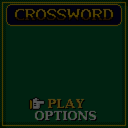

> RPGame 0.3 port: RP2350 RISC-V. Use the [project setup](../../README.md) for builds, wiring and SD packages. The upstream notes below retain CH32 sizes, timings and tool commands as historical context.

# CHCrossword

Solve full 13x13 crosswords with the whole grid on screen, typing on a letter board that slides up while the camera whips in to a close-up of your word. It is a score attack on casino felt: right words lock in gold, words in a row build a combo, and one word in every puzzle is the jackpot.

## Controls

| Button | On the grid | On the letter board |
|---|---|---|
| D-pad | Move to the next open square | Move to another key |
| A | Bring up the letter board | Press the key |
| B | Tap: turn the word, across / down. Hold: the close-up | Rub out (hold: keep rubbing) |
| SELECT | Jump to the next clue not done | Turn the word |
| START | Pause | Put the board away |

On the puzzle list, LEFT and RIGHT change pack when a card with packs is in.

## Rules

- Fill every white square so that each across and down word answers its clue. The clue of the word you are on is under the grid, with its number (`14A`, `7D`).
- A right word locks in gold and pays 10 a letter, times the combo. Every third word in a row without a mistake raises the combo, up to x5.
- A word locked within eight seconds of the last earns half as much again.
- A letter that completes two words at once is a CROSS!: both words, and 50 more times the combo.
- One of each puzzle's longer words is the jackpot (warmer ivory squares, `*X3*` beside the grid): it pays three times over.
- A complete wrong word costs 20 and the combo. The letters stay: fix them.
- REVEAL LETTER, on the pause menu, costs 50 and the combo, and that word then pays half.
- Solving pays 500, two points for every second under par (six seconds a square), 250 more for revealing nothing, and 1,000 instead for a perfect solve with no wrong word either.

| Stars | For |
|---|---|
| One | Solving the puzzle |
| Two | Under par, with nothing revealed |
| Three | Under two-thirds of par, with at most three wrong words |

## How to play

**PLAY** opens the puzzle list: twenty puzzles are built in, six easy, eight medium and six hard. The stars you hold across them make your rank on the list, from ROOKIE to LEGEND at all sixty.

Typing moves on to the word's next empty square, and puts the board away when the word is full. Holding B on the grid is the same close-up to look round in: empty squares show the numbers of the words that start on them.

**OPTIONS:** CHECKING OFF plays it straight: no locks, no combo, the grid judged only when its last square is right (CHECK WORD on the pause menu rubs out a word's wrong letters, for 25). TYPING STEPS moves square by square instead of skipping the filled ones. VIEW CLOSE plays in the close-up all the time, and holding B then shows the whole grid.

SAVE + QUIT on the pause menu keeps the puzzle, clock and score for CONTINUE on the title. Best times, scores and stars are kept for the built-in puzzles, and which puzzles are solved for the last two card packs played.

**More puzzles on the SD card.** Packs of up to 32 puzzles, up to 15x15, go in a folder named `CHCW` at the top level of a FAT32 or FAT16 microSD card (not exFAT), up to eight packs. [`sdcard/CHCW/BONUS.CWD`](sdcard/CHCW) is one to start with, and `tools/puzzles/puz2cwd.py` makes packs from your own Across Lite `.puz` files. The game looks at the card each time you choose PLAY, and the list says so if something is wrong with it.

To put it on the handheld: in the Arduino IDE, with the CHGame board package installed ([Installing](https://github.com/bateske/CHGame#installing)), open it from *File > Examples > CHGame > Games*, set *Tools > USB* to **Upload only** and upload; from a clone of the repository, `chgame upload` in this folder. On a card for the game menu it is in the release's SD card zip.

## Developer notes

- **Reading the SD card beside the screen.** `Pack.cpp` finds `CHCW/*.CWD` with the CHSd library (`<Fat.h>`), only between frames (after `gfx_wait()`) and only on the puzzle list, because the card shares SPI1 with the LCD. A card puzzle is copied into 2 KB of RAM when it starts, so pulling the card mid-puzzle does nothing.
- **A puzzle in about 700 bytes.** `Puzzle.cpp` unpacks one bit a black square (half the grid: the rest is the symmetry), five bits an answer letter, and clues Huffman-coded with one fixed table, decoded one at a time. `tools/puzzles/cwformat.py` is the reference decoder the host tests hold the game to.
- **A close-up that is drawn, not doubled.** `bigTile()` in `Stage.cpp` draws 16-pixel bevelled tiles with clue numbers, lettered in a serif face anti-aliased as far as sixteen colours go: each letter has a layer of half-ink pixels in a tone between its own colour and its tile's (`tools/tilefont.py` makes the table).
- **Drawing only what changed.** The stage redraws when something on it moves, about once a second otherwise for the clock. The pulsing cursor and the shimmer on gold are the palette animating, which costs nothing.
- **Scripts that play like a player.** `tools/chsim/chdrive.py` adds `solve`, which types each word on the letter board through the debug protocol, so one script solves a whole puzzle in the simulator or on the board.
- More in [NOTES.md](NOTES.md): design decisions, making puzzles, tests, the script commands and open items.

## Credits

Apache License 2.0; see `LICENSE` and `NOTICE`. The SD card driver and FAT code are MIT: they are the CHSd library, HypeRunner's, shared with CHWords and CHWordWheel.

The framework is CHBlackjack's (Apache-2.0) by way of CHChess and CHBackgammon, with CHChess's pointing glove and CHBackgammon's display font. CHBlackjack is a derivative of "Blackjack" for the Arduboy by Press Play On Tape (Apache-2.0), and the 3x5 pixel font is Press Play On Tape's.

The close-up's letters are rasterized from DejaVu Serif Bold (Bitstream Vera Fonts Copyright (c) 2003 Bitstream, Inc.; DejaVu changes are in the public domain).

The grids were filled by this project's own grid maker and every clue written for the game. The grid maker chooses words from the ENABLE word list (public domain), ranked by the word frequencies of the wordfreq package (Robyn Speer; its data is CC BY-SA 4.0); neither is part of the game.
