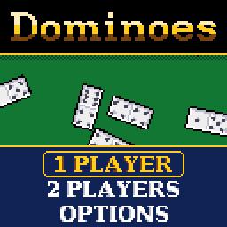

> RPGame 0.3 port: RP2350 RISC-V. Use the [project setup](../../README.md) for builds, wiring and SD packages. The upstream notes below retain CH32 sizes, timings and tool commands as historical context.

# CHDominoes

Lay the double-six set along a line on lamp-lit felt, matching pips end to end and scoring as you go, against one of three CPU opponents or a friend. Play your last tile and the whole line goes off like a string of firecrackers.

## Controls

| Button | Action |
|---|---|
| D-pad | Move the glove along your rack; with a tile that fits several ends, move between those ends; menus |
| A | Play the tile under the glove; with nothing to play, draw from the boneyard; select |
| B | Hold: see the whole table. While choosing an end: put the tile back. Back in the menus |
| SELECT | A hint: the tile the SHARK would play, and where |
| START | Pause: resume, save and quit |

## Rules

- Each side is dealt seven tiles; the rest are the boneyard. A tile is played on an open end of the line whose pips it matches. Doubles lie across.
- With nothing that fits, draw from the boneyard until something does. With the boneyard empty you pass. When neither side can play, the round is BLOCKED.
- In a match's first round the heaviest double is set at once by whoever holds it. After that the winner of a round leads the next with any tile.

**ALL FIVES.** After every tile the open ends are added up (a double at an end counts both its halves), and if the total divides by five, whoever played scores it: FIVE! TEN! FIFTEEN! TWENTY! A double set as the first tile is the *spinner*: once it has a tile on both sides its two free ends open as well, four arms in all, and each counts once a tile has been played on it. When a round ends, the winner also scores the pips left in the other hand, to the nearest five. Play is to 100, 150 or 200; the scores are compared when a round ends, so a round is always played out.

**DRAW.** Nothing is scored during play. The first to play their last tile scores the pips left in the other hand; in a blocked round the lighter hand scores the difference. To 50, 100 or 150.

## How to play

**1 PLAYER** is you against the CPU. Pick the game, the target and the opponent:

| Opponent | How it plays |
|---|---|
| ROOKIE | Plays whatever fits, half the time. |
| REGULAR | Takes every point going, then sheds its heaviest tiles, doubles first. |
| SHARK | Also keeps its next turn open, leaves you the ends you have passed on, and weighs what every tile it cannot see would score in reply. |

The CPU sees what a player sees: its own hand, the line, how many tiles you hold and which pips you have drawn or passed on, never your hand or the boneyard. Your record against each opponent is on the setup screen (hold SELECT there to clear it). **2 PLAYERS** pass the handheld: between turns the rack turns face down until the next player presses A.

At the table your tiles stand on the rack at the foot of the screen, and tiles that fit nowhere are greyed. A plate at each open end shows the pips open there, and the plates your tile fits blink; an end out of view keeps its plate at the edge of the felt. The camera follows the play close up; hold B for the whole table. In ALL FIVES the count at the top turns gold when it is worth points.

OPTIONS has sound, the felt (green, blue, red, purple), the pace (FUN, or QUICK for shorter pauses) and your set of TILES: white, black, ivory, red, blue, jade, grape or pink. Options, records and a match in progress (SAVE + QUIT, then CONTINUE) are kept in flash.

To put it on the handheld: in the Arduino IDE, with the CHGame board package installed ([Installing](https://github.com/bateske/CHGame#installing)), open it from *File > Examples > CHGame > Games*, set *Tools > USB* to **Upload only** and upload; from a clone of the repository, `chgame upload` in this folder. On a card for the game menu it is in the release's SD card zip.

## Developer notes

- **Tiles that are drawn, not stored.** `Table.cpp` has no tile art: close up, `tileFast` runs from SRAM (`RAMFUNC`), works out each kind of row once and copies it down, rather than drawing twenty-odd rectangles a tile.
- **A set of tiles is a palette swap.** Two of the sixteen colours are given to the tiles (BONE and SLATE in `Colours.h`), so `table::useSet` changes the whole set by changing two palette entries.
- **Sprite rotation from a scratch image.** A tile in the air is written as a small image and turned and scaled with the CHGame library's `rotRaw` (`table::spinTile`, `table::spinImage`): the flight to the line, the title's falling tiles (built once each, `fallerImg` in `Screens.cpp`) and the firecrackers in `Stage.cpp`.
- **A round in 56 bytes.** `Dominoes.h` keeps each hand and the boneyard as a bit per tile; the host tests check it step by step against a second, naive implementation.
- **A layout that is never stored.** `Layout.cpp` walks each arm outward over a grid and turns corners at the table's edge; a tile once down never moves, so a saved game's table is simply played again.
- More in [NOTES.md](NOTES.md): design decisions, how it fits together, tests, the script commands and open items.

## Credits

Apache License 2.0; see `LICENSE` and `NOTICE`. The framework is CHBlackjack's (Apache-2.0), by way of CHChess and CHBackgammon; the pointing glove is CHChess's and the anti-aliased lettering is after CHCrossword's. CHBlackjack is a derivative of "Blackjack" for the Arduboy by Press Play On Tape (Apache-2.0), and the 3x5 font is Press Play On Tape's. The serif lettering is rasterized from DejaVu Serif Bold (Bitstream Vera Fonts Copyright (c) 2003 Bitstream, Inc.; DejaVu changes are in the public domain).
