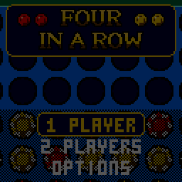

> RPGame 0.3 port: RP2350 RISC-V. Use the [project setup](../../README.md) for builds, wiring and SD packages. The upstream notes below retain CH32 sizes, timings and tool commands as historical context.

# CHFour: Four in a Row

Drop casino chips into a standing blue board and line up four before the dealer does. He plays properly, talks you through the game like a courteous coach, and is gracious whichever way it ends.

## Controls

| Button | Action |
|---|---|
| LEFT / RIGHT | Move your disc over a column; change a setting in the menus |
| A or DOWN | Drop the disc; select |
| B | Back |
| START | Pause: resume, resign, save and quit |
| Any button | Hurry an ending along |

## Rules

- Players take turns dropping one disc into any of the seven columns. It falls to the lowest empty hole.
- The first to get four in a line wins: across, up, or on a diagonal.
- If all 42 holes fill with no four, the game is a draw.

## How to play

**1 PLAYER** puts you (red) against the dealer (gold). Pick who he is today, and who moves first (you, him, or turn about):

| Dealer | How he plays |
|---|---|
| ROOKIE | Takes a win when he sees one and blocks yours, and not much more. Set him two threats at once and he is yours. |
| SHARK | Looks five moves ahead. |
| THE BOSS | Looks as far as 30,000 positions take him: ten moves and more, the whole rest of the game towards the end. |

Your record against each is kept (hold SELECT on that screen to wipe it). **2 PLAYERS** pass the handheld between red and gold while the dealer watches and comments.

What he says is about the position in front of you: *WELL SPOTTED!* for a good block, *LOOK AGAIN* for a missed win, *CAREFUL: I HAVE THREE* when you should worry, and *I SEE A WIN IN 3 MOVES* when his search has found one.

OPTIONS has sound on or off, and PACE: QUICK drops the close-up on the winning four and shortens his pauses.

To put it on the handheld: in the Arduino IDE, with the CHGame board package installed ([Installing](https://github.com/bateske/CHGame#installing)), open it from *File > Examples > CHGame > Games*, set *Tools > USB* to **Upload only** and upload; from a clone of the repository, `chgame upload` in this folder. On a card for the game menu it is in the release's SD card zip.

## Developer notes

- **A search that never stops the frame loop.** The alpha-beta search in `Ai.cpp` keeps its own stack in an array and runs a 5 ms slice per tick, so the game needs no second stack and the screen keeps moving while he thinks.
- **`RAMFUNC` where it pays.** The search's two inner functions run from SRAM, about twice as fast as from flash. Nothing in them calls libgcc: the board is two 64-bit sets of discs, and a cell's bit is made with a 32-bit shift.
- **A still screen is not redrawn.** `stage::render()` returns false when nothing changed and the framebuffer is sent again, while the palette effects keep moving.
- **A camera from integer scaling.** The whip-zoom on the winning four is a zoom in fifths about a world point, with a 20x20 disc for the close-up. The endings draw the dealer at twice the size by scaling his sprite's row spans.
- **Commentary you can test.** His 98 lines in `Taunt.cpp` are picked from what the search and the board analysis report, and the host tests check that an announced forced win comes true.
- More in [NOTES.md](NOTES.md): design decisions, tests, the script commands and open items.

## Credits

Apache License 2.0; see `LICENSE` and `NOTICE`. The dealer and the 3x5 font are from "Blackjack" for the Arduboy by Press Play On Tape (Apache-2.0), by way of CHBlackjack.
