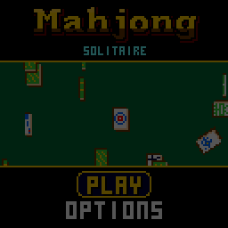

> RPGame 0.3 port: RP2350 RISC-V. Use the [project setup](../../README.md) for builds, wiring and SD packages. The upstream notes below retain CH32 sizes, timings and tool commands as historical context.

# CHMahjong: Mahjong Solitaire

Take 144 traditional tiles off the felt two at a time, with a pointing glove that hops between the ones you can take and a streak that pays more the faster you find the next pair. It is in the casino style of CHBlackjack and CHChess: chips, sparks, a rainbow MAHJONG! when the table is cleared, and a sparrow that comes down to visit the empty felt.

## Controls

| Button | Action |
|---|---|
| D-pad | Move the glove to another free tile; move in the menus |
| A | Pick the tile up; on a matching tile, take the pair; on another tile, pick that one up instead; on the same tile, put it down; select |
| B | Put the tile down; with none in hand, undo the last pair; back |
| B held | The close-up: the camera whips in to twice the size round the glove until you let go. The D-pad and A still play |
| SELECT | Hint: a pair you can take blinks (costs $25) |
| START | Pause: resume, shuffle, new deal, save + quit |
| Any button | Shoo the sparrow away sooner |

UP and DOWN take the glove to the nearest free tile that way; LEFT and RIGHT step through the free tiles in reading order, so either of those alone visits every one.

## Rules

- A pair is two tiles with the same face. Any flower goes with any flower, and any season with any season.
- Both tiles must be **free**: nothing lying on any part of them, and nothing touching their left side, or nothing touching their right. The glove only ever stops on free tiles.
- Clear all 144 tiles to win. Every deal can be cleared.
- When no pair is left the game says so and offers a SHUFFLE (the tiles left are dealt again so that they can be cleared; four a game), UNDO or a NEW DEAL.

| Chips | |
|---|---|
| A pair | $10 |
| The streak | Another pair within five seconds pays double, then triple, up to x5. The bar under the top line shows the time left |
| Flowers and seasons | Double again |
| Clearing the table | $500, and $1 for every second under fifteen minutes |
| Undo | Gives the pair's chips back |
| Hint | Costs $25 |
| Shuffle | Costs $100 |

## How to play

PLAY, then pick one of four layouts: the classic TURTLE, ARENA, BRIDGE or TWINS. Your best chips and time on each are on that screen (hold SELECT there to clear them).

On the table, the tile under the glove is raised with a shimmering outline, and a plate at the foot of the screen names it (BAMBOO 5, RED DRAGON). Pick one up and it floats with a rainbow outline, its free twins blink, and the plate says PAIR! when the glove is on one. Leave the glove alone for a moment and it draws back to the corner, so it hides nothing while you look.

OPTIONS has sound, the table colour (green, blue, red or purple felt), TILES (CLASSIC, the traditional faces, or EASY: numbers and a mark for the suit), VIEW (FULL, or CLOSE: play in the close-up, and B held shows the whole table) and PACE (FUN, or QUICK: no deal animation, shorter flights).

Options, bests and a game in progress (SAVE + QUIT, then CONTINUE) are kept in flash and survive re-uploading. The games share the same two save pages, so saving in another game replaces this one's.

To put it on the handheld: in the Arduino IDE, with the CHGame board package installed ([Installing](https://github.com/bateske/CHGame#installing)), open it from *File > Examples > CHGame > Games*, set *Tools > USB* to **Upload only** and upload; from a clone of the repository, `chgame upload` in this folder. On a card for the game menu it is in the release's SD card zip.

## Developer notes

- **Work spread over frames, with the same answer.** A deal is made in `MahjongBoard.cpp` by playing a full table backwards, a few pairs a frame under the shuffle rattle, and comes out the same however the work is split. So a saved game (`Save.cpp`) is only the seed, the layout and the pairs taken, replayed.
- **`RAMFUNC` blitters with colours chosen at draw time.** `Tile.cpp` draws 2-bit faces through a lookup table from SRAM, so one set of art is a tile, a white flash or a gold shimmer. The 1x and 2x sizes are byte-wide copies; only the camera's in-between sizes go a pixel at a time.
- **A still table is not redrawn.** `stage::render()` in `Stage.cpp` returns false when nothing moved, and the outlines keep shimmering because they are palette colours that animate for free.
- **Generated tables.** `tools/layouts.py` turns the text maps in `tools/layouts/` into `src/game/Layouts.cpp` (about 100 bytes a layout) and checks that each fits the screen and can be dealt; `tools/assets.py` packs the faces and works out their emboss.
- **Navigation you can prove.** `Nav.cpp` moves the glove between free tiles only, and the host tests in `tools/tests/test_board.cpp` check that every free tile can be reached.
- More in [NOTES.md](NOTES.md): design decisions, how it fits together, tests, the script commands and open items.

## Credits

Apache License 2.0; see `LICENSE` and `NOTICE`. The shared code, the palette, effects and the pointing glove's art are from CHChess and CHBlackjack (both Apache-2.0). CHBlackjack is a derivative of "Blackjack" for the Arduboy by Press Play On Tape (Apache-2.0): the 3x5 font is theirs, and the title's lettering is drawn in the face of their Blackjack logo. The sparrow's animations are from a sparrow pixel-art animation pack by an uncredited artist.
