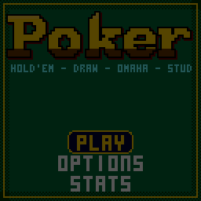

> RPGame 0.3 port: RP2350 RISC-V. Use the [project setup](../../README.md) for builds, wiring and SD packages. The upstream notes below retain CH32 sizes, timings and tool commands as historical context.

# CHPoker

Sit down at a casino table against three CPU players and bet, bluff and draw your way from a $500 purse to breaking the bank. Four games in one: Texas Hold'em, Five Card Draw, Omaha and Seven Card Stud.

## Controls

| Button | Your turn to bet | The draw | Elsewhere |
|---|---|---|---|
| LEFT / RIGHT | Choose FOLD, CHECK or CALL, BET or RAISE, ALL IN (POT in Omaha) | Move the glove along your cards and to DRAW | Change a setting |
| UP / DOWN | Size the bet or raise in chips (hold: faster) | UP throws the card, DOWN keeps it | Move in the menus |
| A | Do it | Throw or keep the card; on DRAW, draw | Select |
| B | | | Back |
| START | Pause: resume, options, hand ranks, leave the table | | |
| SELECT | | | Hold on Stats to reset them |

## Rules

- **Hold'em**, no limit: two cards each, five on the board.
- **Omaha**, pot limit: four cards each, and a hand must use exactly two of them with three from the board.
- **Five Card Draw**, fixed limit: blinds, a round of bets, one draw of up to three cards (four if you keep an ace), small bets before the draw and big bets after.
- **Seven Card Stud**, fixed limit: antes; two cards down and one up; the lowest card showing (by suit: clubs, diamonds, hearts, spades) brings in, and from fourth street the best hand showing bets first; four up cards, the last one down.

Bets:

- No limit: a raise must at least match the last raise, and a short all-in does not re-open the betting for players who have already acted.
- Pot limit: the most you can raise to is the pot after your call.
- Fixed limit: a round is capped at a bet and three raises.
- Uncalled bets are returned, side pots are split at each all-in, and an odd chip goes to the first winner left of the button. Every hand still in at the end is shown.

Simplified from casino rules: the bring-in can't complete, stud has no open-pair big bet on fourth street, and a new CPU is dealt in without posting.

## How to play

You start with a $500 purse. In the lobby, pick the game, the table and how much to sit down with (20 to 100 big blinds); leaving the table puts your chips back in the purse.

| Table | Stakes | The CPUs |
|---|---|---|
| ROOKIE | $1/$2 blinds ($2/$4 limit) | Call too much and rarely raise |
| PRO | $5/$10 ($10/$20) | Play the odds |
| SHARK | $25/$50 ($50/$100) | Tight, aggressive, bluff, and notice when you bluff |

A CPU that goes broke leaves, and a new player takes the seat. When your chips run out you can buy in again from the purse. Reach the goal ($10,000, $50,000 or endless, in OPTIONS) and you've broken the bank; let the purse fall below the smallest buy-in and you're broke, and start again with $500. Your purse, options and statistics are saved at hand ends and survive re-uploading.

The CPUs judge their hands the way a player does, by imagining the rest of the hand: each plays it out with random cards for what it can't see, while its plate glows and a soft clock ticks, and weighs the share it wins against the price of calling. They never see your cards or each other's.

To put it on the handheld: in the Arduino IDE, with the CHGame board package installed ([Installing](https://github.com/bateske/CHGame#installing)), open it from *File > Examples > CHGame > Games*, set *Tools > USB* to **Upload only** and upload; from a clone of the repository, `chgame upload` in this folder. On a card for the game menu it is in the release's SD card zip.

## Developer notes

- **A hand evaluator with no tables.** `Hand.cpp` builds a rank mask per suit, finds straights with four shifts and ANDs, and counts ranks for pairs, trips and quads, for 1 to 7 cards at once. The host tests check it over every five-card and seven-card hand.
- **CPU thinking spread over frames.** `Ai.cpp` runs a fixed number of random play-outs on each frame's first logic tick (see `CHPoker.ino`), so the table keeps animating and scripted runs stay deterministic.
- **Rules without graphics.** `Table.cpp` plays the hand and emits events (`Ev::Deal`, `Ev::Action`, ...); `Stage.cpp` turns them into motion. The same rules compile into the host tests with no display.
- **Four games as data.** `Variants.cpp` describes each game's limit, cards and streets in one table row, and the three tables' stakes in another.
- **A still table is not redrawn.** `stage::render()` returns false when nothing changed and the frame is sent again, so the palette's rainbow and gold pulses keep moving for free.
- More in [NOTES.md](NOTES.md): design decisions, how it fits, tests, the script commands and open items.

## Credits

Apache License 2.0; see `LICENSE` and `NOTICE`. The card art, suit glyphs, 3x5 lettering and the letters of the title come from "Blackjack" for the Arduboy by Press Play On Tape - Simon Holmes (filmote), code, and Stephane C (vampirics), art - Apache-2.0, by way of CHBlackjack, which also gave the chips, the action bar, the palette, the sound sequencer, flash saving and the PC simulator. From CHChess (Apache-2.0): the input and frame pacing, drawing primitives, outlined lettering, effects, the pointing glove, the word-drop plate, the setup-screen choices, the debug protocol and the simulator's script driver.
