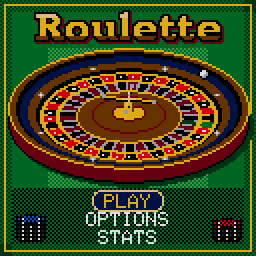

> RPGame 0.3 port: RP2350 RISC-V. Use the [project setup](../../README.md) for builds, wiring and SD packages. The upstream notes below retain CH32 sizes, timings and tool commands as historical context.

# CHRoulette

Point the glove at the felt, stack your chips on numbers, lines and corners, and call the spin: the camera whips to the wheel, the ball laps the track, rattles over the frets and settles. The croupier from the Blackjack tables rakes in the losers, pays the winners and slides your winnings home.

## Controls

| Button | Action |
|---|---|
| D-pad, tapped | The glove steps half a cell, onto the lines and corners between numbers (taps wrap round the edges); moves in the menus |
| D-pad, held | The glove runs from cell to cell and stops at the edges |
| A | Drop a chip (hold to repeat); on a chip in the bar: use that chip; on CLR: press twice to clear; on SPIN: spin; select |
| B | Take a chip back (hold to repeat); back |
| SELECT | Next chip you can afford |
| START | Pause: resume, options, save and quit |
| A, held during the spin | The ball at double speed (press it again after SPIN) |

## Rules

Bet on where the ball will land, on as many spots as you like. The **European** wheel has one zero and 37 pockets; the **American** has 0 and 00, 38 pockets, and the top line 0/00/1/2/3 instead of the first four. Payouts are the casino's:

| Bet | Pays |
|---|---|
| Straight up (one number) | 35 to 1 |
| Split (two) | 17 to 1 |
| Street, trio (three) | 11 to 1 |
| Corner, first four (four) | 8 to 1 |
| Top line (five, American) | 6 to 1 |
| Six line | 5 to 1 |
| Column, dozen | 2 to 1 |
| Red, black, odd, even, 1-18, 19-36 | 1 to 1 (they lose on 0 and 00) |

Chips are $1, $5, $10, $25 and $100, with up to $100 on an inside bet, $250 on an outside bet and $1,000 on the table. The American wheel's 0/2 and 00/2 splits are not offered.

## How to play

You start with $500 and play to the goal ($1000, $5000 or endless) or until you are broke. The plate under the layout names the bet the glove is on, what is on it and what it pays (*SPLIT 17/20 $10 17 TO 1*), and every number the bet covers lights up. A winning bet stays on the table for the next spin, and the losing ones are placed again for you if your purse covers them, as on a real table; CLR takes it all back.

OPTIONS has the wheel, the goal, the pace (FUN, or QUICK for shorter spins and payouts), the sound (the melody, an arpeggio of all the voices, or off) and the croupier's look. STATS keeps your spins, wins, biggest win, straight-up hits and the hot and cold numbers (hold SELECT there to reset them). Options, statistics and a game in progress are saved: SAVE & QUIT, then CONTINUE.

To put it on the handheld: in the Arduino IDE, with the CHGame board package installed ([Installing](https://github.com/bateske/CHGame#installing)), open it from *File > Examples > CHGame > Games*, set *Tools > USB* to **Upload only** and upload; from a clone of the repository, `chgame upload` in this folder. On a card for the game menu it is in the release's SD card zip.

## Developer notes

- **A spinning wheel from one table lookup.** `WheelArt.cpp` paints the rotor from a polar angle map of one quadrant (`src/assets/WheelMap.cpp`, made by `tools/wheel.py`), mirrored four ways through a colour table built each frame in CHGfx's spare chunk buffer (`gfx_chunkScratch()`). The per-pixel loop is a `RAMFUNC`.
- **A ball that lands where the rules said.** The number is picked when you press SPIN. `Ball.cpp` is an integer simulation with a solver that dry-runs the spin a slice per tick while the croupier calls NO MORE BETS, then turns the rotor by whole pockets so the ball settles in the right one.
- **Redraw only what changed.** The wall, the layout and the action bar repaint only when what they show changes or something moving touches them; every frame is still sent, so the palette effects cost nothing. `Felt.cpp` builds each layout row once and stamps it down with `gfx_copyRow`.
- **Rules apart from graphics.** `Roulette.*`, `Spots.*`, `Nav.*` and `Wheel.*` (the bets, the spots, the glove's navigation, the wheels) draw nothing and are tested on the PC against an independent Python model; `Presenter.cpp` turns the rules' events into motion.
- **Features behind switches.** Flash is the limit here: the credits room and an attract demo are in the code but switched off in `config.h` (`CHRL_CREDITS`, `CHRL_DEMO`).
- More in [NOTES.md](NOTES.md): design decisions, tests, the script commands and open items.

## Credits

Apache License 2.0; see `LICENSE` and `NOTICE`. The croupier is the dealer from "Blackjack" for the Arduboy by Press Play On Tape - Simon Holmes (filmote), code, and Stephane C (vampirics), art (Apache-2.0) - as recoloured for CHBlackjack, as are the end screens' lettering and the 3x5 font. The table's wall, rail and chips and two tunes are CHBlackjack's; the pointing glove, its navigation and the word plate are from CHChess (both Apache-2.0).
