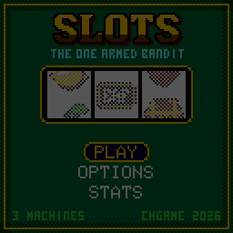

> RPGame 0.3 port: RP2350 RISC-V. Use the [project setup](../../README.md) for builds, wiring and SD packages. The upstream notes below retain CH32 sizes, timings and tool commands as historical context.

# CHSlots

Pull the arm, spin the reels and try to break the bank on three slot machines that share one purse: a one-armed bandit with a bonus wheel, a candy machine with a multiplier ladder, and a five-reel cabinet in red and gold with a dragon, free games and four jackpot meters.

## Controls

| Button | Action |
|---|---|
| A | LUCKY 7: hold to pull the arm, let go to spin. SWEET and DRAGON FORTUNE: spin. During a spin: stop the reels now |
| B | The paytable. It scrolls by itself; UP / DOWN scroll it, A and B skip a page, START closes it |
| UP / RIGHT, DOWN / LEFT | Raise or lower the bet; move in the menus |
| SELECT | Next bet, wrapping round |
| START | Pause: RESUME, MACHINES, OPTIONS, SAVE & QUIT |

## Rules

**LUCKY 7** has three reels and one line. Bets are $1, $5, $10 or $25.

- Three alike on the middle line pay, from 15x the bet (lemons, oranges) through 250x (sevens) to 500x (treasure chests). One cherry anywhere on the line pays 1x, two pay 5x.
- When the first two reels show a pair worth 100x or more, the third reel creeps in.
- **Bonus wheel.** Two lucky charms (clover, horseshoe) on the line spin the wheel once: twelve wedges from 3x to 60x the bet. It comes up about one pull in 48.
- It returns 94.9% (computed exactly over all 42,875 stops), with a win on 33% of pulls.

**SWEET** has three reels showing three rows. Bets are $5, $10, $25 or $50, always on all five lines: the three rows and the two diagonals.

- Three alike on a line pay, from 1x the bet (gumdrops) to 30x (gummy bears).
- **Lollipop (wild).** Stands for any sweet; three lollipops on a line pay 50x.
- **Sugar rush.** Every winning spin moves the ladder up a step, and the next spin pays at that step: x1, x2, x3, then x5. A spin that wins nothing sends it back to x1.
- Over 4 million simulated spins it returned 95.7%, with a win on 23% of spins; 1.3% of spins are played at x5.

**DRAGON FORTUNE** has five reels. Bets are $5, $10, $25 or $50, always on all 25 lines, which pay left to right for three, four or five of a kind.

- **Dragon (wild).** Lives on reels 2 to 4. Wherever it lands it rises to fill the reel and stands for any picture.
- **Gongs (free games).** Three or more anywhere pay 2x, 10x or 50x the bet and start eight free games at double pay. They can retrigger.
- **Coins (Hold and Spin).** Six or more on screen lock in place and you get three respins; every new coin locks and resets the count to three. At the end each coin pays what it shows: 1x to 5x the bet, or the MINI, MINOR or MAJOR meter. Fill all fifteen cells for the GRAND.
- **Meters.** MINI is 20x the bet and MINOR 50x. MAJOR starts at 200x and GRAND at 1000x, and both grow with every spin until somebody wins them.
- Over 6.3 million simulated games it returned 95.3%: 52.5% from lines, 4.6% from gongs, 15.0% from free games and 23.1% from Hold and Spin. Free games come about one game in 64, Hold and Spin one in 87.

Press B at any machine for its whole paytable.

## How to play

You start with $500. Pick a machine from the menu (UP / DOWN, then A); the purse goes with you when you change machines from the pause menu. Left alone, the title plays a demo.

Reach the goal to break the bank; run out of money and you are broke. OPTIONS sets the goal ($1000, $5000 or endless) and turns the music on or off, and STATS is on the title menu.

The game saves by itself every ten spins and on SAVE & QUIT, never in the middle of a feature. The purse, the machine, the bets and DRAGON FORTUNE's growing meters are all kept.

To put it on the handheld: in the Arduino IDE, with the CHGame board package installed ([Installing](https://github.com/bateske/CHGame#installing)), open it from *File > Examples > CHGame > Games*, set *Tools > USB* to **Upload only** and upload; from a clone of the repository, `chgame upload` in this folder. On a card for the game menu it is in the release's SD card zip.

## Developer notes

- **Rules first, show after.** `Slots.cpp` settles a spin in one call (stops, wins, features) and has no graphics in it; `Presenter.cpp` replays the result as reels, banners and coins while the rules wait. The host tests link the rules alone.
- **Generated reel strips.** `tools/strips.py` lays out `src/game/Strips.h` from symbol counts with a fixed seed, and `chgame test` measures the returns quoted above for exactly those strips.
- **Three bands, redrawn only when needed.** The play screen is top, reels and bottom, each redrawn only when what it shows changed or something moved across it. `chgame redraw` runs the game beside a build that redraws everything every frame and reports any stale pixel.
- **A palette per machine.** The art uses the series' 16 colours; `mach::THEMES` in `Machine.cpp`, handed to the library's `pal::setThemes()` in `CHSlots.ino`, swaps the three felt greens for maroon, jade and orange on DRAGON FORTUNE and pink, mint and lilac on SWEET.
- **Tunes under the effects.** The three `audio::Melody` tunes in `Sounds.cpp` are one line of notes each, looped by the CHGame library beneath the sound effects.
- More in [NOTES.md](NOTES.md): design decisions, sizes, tests, the script commands and open items.

## Credits

Apache-2.0; see `LICENSE` and `NOTICE`. The 3x5 font comes from Press Play On Tape's Arduboy Blackjack by Simon Holmes (filmote) and Stephane C (vampirics), by way of CHBlackjack.
