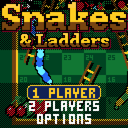

> RPGame 0.3 port: RP2350 RISC-V. Use the [project setup](../../README.md) for builds, wiring and SD packages. The upstream notes below retain CH32 sizes, timings and tool commands as historical context.

# CHSnakes: Snakes & Ladders

Roll the dice and race your fruit from square 1 to 100, up the ladders and past eight wriggling snakes that see you coming, open their jaws, swallow you whole and spit you out at the tail. The childhood board game on casino felt in a wooden frame, with a camera that follows every hop, climb and slide.

## Controls

| Button | Action |
|---|---|
| A | Roll; in ARCADE, take the die chosen; select in the menus |
| LEFT / RIGHT | ARCADE: choose a die (the bar says where each one takes you); change a setting in the menus |
| UP / DOWN | Move through the menus |
| SELECT | The whole board, and back |
| START | Pause: resume, options, save and quit |

## Rules

Everyone starts on square 1. First to 100 wins. Land on the foot of a ladder and climb it; land on a snake's head and slide to its tail.

**CLASSIC** is the game you know:

- One die. A six rolls again (two extra rolls at most).
- 100 needs the exact roll: go past it and you bounce back by what is left over, possibly onto the snake at 99.
- Squares are shared.

**ARCADE** gives you something to decide:

- Two dice, and you pick which one to move by. The bar at the foot of the screen shows what each would do (TO 47, UP TO 59, DOWN TO 5, BUMP P2, WIN!), and an arc of dots marches from your token to the square, which flashes red if a snake is waiting there.
- Doubles move and roll again (two extra rolls at most).
- Land on a rival and it is bumped straight down a row, and takes whatever ladder or snake it drops onto. Square 1 is safe.

## How to play

**1 PLAYER** is you against a CPU; **2 PLAYERS** is the two of you, passing the handheld. Either way THE TABLE comes up set and A starts; it can seat up to four, each a person or a CPU, and chooses the game. A CPU's turn goes by quickly, seen from above: the show is for your own.

The CPUs come in three kinds:

| CPU | How it plays ARCADE |
|---|---|
| EASY | Picks blind. |
| FAIR | Takes the square further on. |
| SHARK | Knows how many turns every square is from home, bumps the leader and keeps out of bumping range. |

The top bar shows everyone's square. A roll from home, your heart beats and the plate says what you need. When it is over, the result shows where everyone finished, the ladders and snakes each took, and the story of the game: everyone's square, turn by turn.

OPTIONS has sound on or off, and the pace: FUN, or QUICK (faster turns, no close-ups). Options, the house's records and a game in progress (SAVE + QUIT, then CONTINUE, which picks the game up as that turn began) are saved to flash and survive re-uploading.

To put it on the handheld: in the Arduino IDE, with the CHGame board package installed ([Installing](https://github.com/bateske/CHGame#installing)), open it from *File > Examples > CHGame > Games*, set *Tools > USB* to **Upload only** and upload; from a clone of the repository, `chgame upload` in this folder. On a card for the game menu it is in the release's SD card zip.

## Developer notes

- **Snakes without sprites.** In `BoardView.cpp` each snake is a chain of round beads along the line from head to tail, pushed sideways by a sine wave that travels down the body, so it wriggles, thrashes after a meal and shows a bulge in your colour going down. Only the head is art, turned the way the neck runs.
- **A zooming top-down board from row patterns.** The board is drawn in world space and the view is a zoom about the camera, whipping between the whole board and the close-up a step a frame. Each row of the screen is a copy of one of five patterns, and the span fillers are `RAMFUNC`s while the rest of the file is `#pragma GCC optimize("Os")`.
- **Rules apart from the show.** `Game.cpp` is plain logic with no graphics: a phase machine that reports events (dice, moves, ladders, snakes, bumps) and waits while `Stage.cpp` shows them. The host tests play 100,000 games through it.
- **A strong CPU in 101 bytes.** The SHARK's knowledge is `TURNS[]` in `Cpu.cpp`, the turns still to go from each square with the best play, worked out on the PC by `tools/turns.py` and checked against the board by the tests.
- **The title is the game playing itself**: four CPUs at ARCADE behind the lettering.
- More in [NOTES.md](NOTES.md): design decisions, tests, the script commands and open items.

## Credits

Apache License 2.0; see `LICENSE` and `NOTICE`. Copyright 2026 bateske. Adapted from [CHBoardwalk](../CHBoardwalk), [CHChess](../CHChess) and [CHBlackjack](../CHBlackjack) (all Apache-2.0): the input and frame pacing, palette, drawing, outlined lettering, effects, sound sequencer, flash saving, debug protocol, the game/stage event flow, the fruit tokens, the die, the pointing glove and the PC simulator and tools. The top-down zooming view follows CHBackgammon's (Apache-2.0). CHBlackjack is a derivative of "Blackjack" for the Arduboy by Press Play On Tape (Apache-2.0), and the 3x5 pixel font is Press Play On Tape's. Everything else - the board, the ladders and snakes and how they are drawn, the rules of both games, the CPU players and the presentation - is new.
