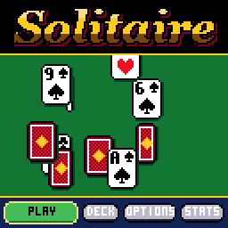

> RPGame 0.3 port: RP2350 RISC-V. Use the [project setup](../../README.md) for builds, wiring and SD packages. The upstream notes below retain CH32 sizes, timings and tool commands as historical context.

# CHSolitaire

Klondike after the Solitaire that came with Windows: a pointing glove lifts cards and whole runs and carries them, rainbow-edged, to where they should go. When the last king goes up, the pack bounces off the foundations one card at a time and leaves its trail across the screen.

## Controls

| Button | Action |
|---|---|
| LEFT / RIGHT | Move the glove from pile to pile; change a setting in the menus |
| UP / DOWN | In a column: take more or fewer cards of the run. Past the top of the run, UP goes to the stock, waste and foundations, and DOWN comes back |
| A | Pick up; put down. On the stock: deal. Twice quickly on a card: send it to its foundation. Select in the menus |
| B | Put the cards back; with an empty hand, deal from the stock. Back in the menus |
| SELECT | Undo the last move; hold on Stats to reset them |
| START | Pause: resume, new deal, deck, options, quit |

A press never waits for an animation: cards still in the air land at once.

## Rules

- The stock deals to the waste three at a time (or one, in Options). Only the top card of the waste plays.
- Columns build down in alternating colours. A king, or a run that starts with one, goes on an empty column.
- The four foundations build up by suit from the ace. Dropping a card on any foundation sends it to its own, and a card can come back down from a foundation.
- Once everything is face up and the stock is done, the game plays itself out.

Scoring is as Windows scored it:

| Scoring | How it counts |
|---|---|
| Standard | 10 for a card to a foundation, 5 from the waste to a column, 5 for turning a card up, -15 for taking a card back off a foundation. Turning the waste over costs 100 when dealing one card, and 20 from the fourth time through when dealing three. The score never goes below zero. |
| Standard, timed | Also loses 2 points every ten seconds, and ends with a bonus of 700,000 divided by the seconds the game took (if it took at least 30). |
| Vegas | Every deal costs $52 and every card on a foundation pays $5. You go through the stock three times dealing three, once dealing one, and then the stock shows a red X. The bank carries over from game to game. |
| None | No score. |

## How to play

PLAY on the title deals a game, or picks up the one you left. Legal places shimmer while you carry a card, and a finished suit gets its name called.

OPTIONS has draw one or draw three, the scoring, the timed game on or off, sound, and a four-colour deck (green clubs, blue diamonds). Draw, scoring and timing take effect with the next deal. DECK is a choice of twelve card backs, some of which move. There is one level of undo, score included; the clock does not run back.

Pausing saves: the game on the table, the bank, your options, deck and statistics go to flash and survive switching off and re-uploading. A new deal walks away from the one on the table, which ends a winning streak (a deal you never touched does not count). STATS keeps the record.

To put it on the handheld: in the Arduino IDE, with the CHGame board package installed ([Installing](https://github.com/bateske/CHGame#installing)), open it from *File > Examples > CHGame > Games*, set *Tools > USB* to **Upload only** and upload; from a clone of the repository, `chgame upload` in this folder. On a card for the game menu it is in the release's SD card zip.

## Developer notes

- **A trail that costs nothing.** CHGfx keeps one 16-colour framebuffer and nothing clears it but the game. During the cascade (`Stage.cpp`) the table is not redrawn: each logic tick stamps the bouncing card where it is, up to three stamps a frame when the game is catching up, so the trail has no gaps.
- **Logic ticks apart from drawing.** `CHSolitaire.ino` runs up to three 60 Hz logic ticks while the previous frame is still going out over DMA, then waits, draws once and flushes.
- **A game small enough to copy.** The whole game in `Klondike.h` is 196 bytes (the stock and the waste share one 24-card array), so undo is a copy of the struct and a save is one flash page; a `static_assert` in `Save.cpp` holds it to that.
- **Seven columns in 128 pixels.** That leaves 18 a column, so the card is 17x23 and a covered card is drawn as its top strip only (`CardArt.cpp`). A column squeezes its overlap as it grows (`Layout.h`).
- **Caching a costly layer.** The title's outlined lettering is drawn once and kept as a copy of its framebuffer rows (`rail` in `Screens.cpp`), and the drifting cards pass under the copy.
- More in [NOTES.md](NOTES.md): design decisions, tests, the script commands and open items.

## Credits

Apache License 2.0; see `LICENSE` and `NOTICE`. The card faces, suit glyphs and 3x5 lettering come from "Blackjack" for the Arduboy by Press Play On Tape - Simon Holmes (filmote), code, and Stephane C (vampirics), art - Apache-2.0, by way of CHBlackjack and CHPoker. The pointing glove, input and effects are from CHChess (Apache-2.0). The game follows the rules, the scoring and the manners of the Solitaire that came with Microsoft Windows; no code or art of it is used.
