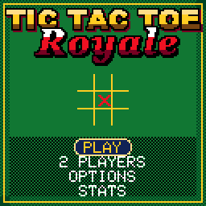

> RPGame 0.3 port: RP2350 RISC-V. Use the [project setup](../../README.md) for builds, wiring and SD packages. The upstream notes below retain CH32 sizes, timings and tool commands as historical context.

# CHTicTacToe: Tic Tac Toe Royale

Play noughts and crosses against the croupier, for money, at sixteen tables with sixteen sets of rules. The world's simplest game gets the VIP room: lacquered Xs and Os carried in by a white glove onto a walnut board, "TIC", "TAC" and "TOE!" called as a line builds, and a cat that walks across the felt whenever nobody wins.

## Controls

| Button | Action |
|---|---|
| D-pad | Move the glove (on the isometric tables, to the nearest cell that way on screen); menus; in the tables room LEFT / RIGHT picks the table, UP / DOWN the stake |
| A | Place your mark; select |
| B | GOBBLE: next chip size; WILD: place an O; back in the menus |
| SELECT | 3x3 and 5x5 tables: flip between the isometric table and the flat map; other tables: the rules |
| START | Pause: resume, how to play, options, walk away (the stake stays) |

## Rules

Get the table's line before the dealer does. You move first, except in BLITZ, where the opening alternates. A win pays the table's odds, a draw is a push, a loss costs the stake.

| # | Table | Rules | Pays |
|---|---|---|---|
| 1 | CLASSIC | 3x3, three in a row | 1:1 |
| 2 | BLITZ | 60 seconds of boards, 3 seconds a move or a random square is played for you; a lost board costs 5 seconds; boards won pay 1/4, 3/4, 1 1/2, 2 1/2, 3 3/4... of the stake | by the board |
| 3 | MISERE | Three in a row loses | 1:1 |
| 4 | ALL X | Both sides play X; whoever completes three in a row loses (notakto) | 1:1 |
| 5 | VANISH | Three marks a side: place a fourth and your oldest disappears; no draws | 1:1 |
| 6 | GOBBLE | Chips in three sizes, two of each; a bigger chip may cover a smaller one | 3:2 |
| 7 | WILD | Play an X or an O each turn; whoever completes a line of either wins | 1:1 |
| 8 | DARK | The dealer's marks are hidden; walking into one reveals it and you move again | 2:1 |
| 9 | COIN FLIP | A coin toss before every move decides who makes it | 1:1 |
| 10 | AUCTION | Both sides have 8 chips and bid for each move; the higher bid moves and pays the other; ties go turn about | 2:1 |
| 11 | BIG 5 | 5x5, four in a row | 2:1 |
| 12 | WRAP | 5x5, four in a row, and lines continue round the edges | 1:1 |
| 13 | MINES | 5x5, four in a row; four hidden mines: a mark put on one is lost and the cell is dead | 3:1 |
| 14 | DROP 4 | 7x6, marks fall to the bottom of their column, four in a row | 2:1 |
| 15 | ULTIMATE | Nine 3x3 boards; the square you play picks the board the other side must play in; three boards in a row wins (all boards decided: most boards) | 5:1 |
| 16 | THE 99 | 11x9 = 99 squares, five in a row | 5:1 |

## How to play

**PLAY** starts you with $100. Pick a table and a stake ($5 to $250) and play the dealer; he explains each table as you browse. Wins in a row add a quarter of the winnings each, up to double. The run ends when you reach the goal or cannot cover $5. The run (purse, table, stake, streak), the options and the statistics are saved.

**2 PLAYERS** take turns on one handheld (the second player's glove has the red cuff). No money: the score is kept instead. BLITZ, DARK and AUCTION are not offered, since they need a clock or a secret.

OPTIONS:

- **DEALER**: TIPSY (he slips up; the odds as listed), SHARP (pays double), SHARK (pays triple).
- **GOAL**: $1000, $5000 or ENDLESS.
- **SOUND**: on or off.
- **CROUPIER**: CLASSIC or NIGHT colours.

To put it on the handheld: in the Arduino IDE, with the CHGame board package installed ([Installing](https://github.com/bateske/CHGame#installing)), open it from *File > Examples > CHGame > Games*, set *Tools > USB* to **Upload only** and upload; from a clone of the repository, `chgame upload` in this folder. On a card for the game menu it is in the release's SD card zip.

## Developer notes

- **Sixteen games from one board type.** `Rules.h` describes a table as a grid, a line length and a set of rule flags (`F_VANISH`, `F_WRAP`, `F_MINES` ...), and one line scanner serves them all, so a new table is mostly a flag and a paragraph of text.
- **An isometric table with band redraws.** `Iso.cpp` draws the 3x3 and 5x5 tables; `stage::render()` in `Stage.cpp` redraws only on frames where something moved, and when only the glove or the cursor moved it sets CHGfx's clip rectangle (`gfx_setClip`) to the rows they swept. `chgame redraw` checks band redraws against full ones pixel for pixel.
- **Animation without drawing.** The library's palette cycling (`pal::`) animates the cursor, the fading VANISH mark and the rainbow strike through the winning line with no redraw.
- **A dealer that shares the frame.** `Cpu.cpp` searches the real rules to a limited depth on the 3x3 tables; on the big felts it scores every empty cell by the lines it could still make or break, 12 cells a frame.
- **Ray-marched pieces.** `tools/pieces.py` renders the Xs and Os from signed-distance models at the board's 30 degree camera, in two sizes plus the spin frames, quantised to the palette.
- More in [NOTES.md](NOTES.md): design decisions, tests, the script commands and open items.

## Credits

Apache License 2.0; see `LICENSE` and `NOTICE`.

- From [CHBlackjack](../CHBlackjack) (Apache-2.0), by way of CHRoulette: the input and frame pacing, palette, drawing, outlined lettering, effects, sound sequencer, flash saving, debug protocol, the PC simulator and tools, the table's wall and rail, the chips, the croupier with his expressions and the end-screen lettering.
- CHBlackjack is a derivative of "Blackjack" for the Arduboy by Press Play On Tape - Simon Holmes (filmote), code, and Stephane C (vampirics), art ([Press-Play-On-Tape/Blackjack](https://github.com/Press-Play-On-Tape/Blackjack), Apache-2.0). The croupier is Press Play On Tape's dealer, recoloured and retouched by hand; the "YOU WON THE BANK" and "YOU ARE BROKE" lettering and the 3x5 pixel font are theirs.
- From [CHChess](../CHChess) (Apache-2.0): the pointing glove, the soft clock ticks and the shake routine.
- Everything else is new; the title lettering was drafted from the Arial Black and Georgia typefaces by `tools/make_logo.py`.
