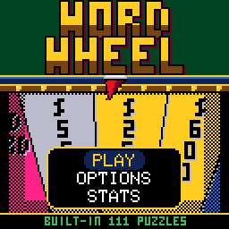

> RPGame 0.3 port: RP2350 RISC-V. Use the [project setup](../../README.md) for builds, wiring and SD packages. The upstream notes below retain CH32 sizes, timings and tool commands as historical context.

# CHWordWheel

Spin the wheel, call a consonant, buy a vowel and solve the puzzle before the other two podiums do. It is a whole word-puzzle game show in the casino style of [CHBlackjack](../CHBlackjack), hosted by the dealer from its tables, who has something to say about most of it.

## Controls

| Button | Action |
|---|---|
| LEFT / RIGHT | On your turn: SPIN, VOWEL $250 or SOLVE |
| D-pad | Move over the letters |
| A | Choose; hold to wind up the wheel and let go to spin; pick a letter; when solving, type it, then confirm |
| B | Back out of buying a vowel; when solving, rub out |
| SELECT | When solving: next blank panel |
| START | Pause: resume, options, save and quit |
| A, held | Hurries the host and a CPU's spin |
| Any button | Buzz in at a toss-up, with one human playing |

With two humans at a toss-up, the first buzzes with the D-pad and the second with A or B; with three, it is the D-pad, SELECT, and A or B.

## Rules

- **Toss-up** ($1,000, and $2,000 before round 3): panels turn one at a time until someone buzzes in and solves. A wrong answer locks you out. The winner starts the next round.
- **A round**: on your turn, spin, buy a vowel ($250) or solve. A consonant that is there pays the wedge's value for each panel it turns, and you go again; one that is not passes the turn. Only the contestant who solves keeps their round's money, and the house makes a small win up to $1,000.
- **The wheel** has 24 wedges of three peg slots:
  - **BANKRUPT** takes your round money and any tokens; **LOSE A TURN** just the turn.
  - **FREE PLAY**: any letter - a vowel costs nothing, a miss costs nothing.
  - The **top-dollar wedge**: $2,500, then $3,500, then $5,000.
  - Round 1: the **WILD CARD** (play it after a hit to call a second consonant at the same value, or take it to the bonus round for an extra consonant) and the **trip** ($3,000 if you go on to win the round); each is yours only if the letter you call is there.
  - Round 2: two **mystery wedges** - $1,000 a letter, or flip it for $10,000 or a bankrupt.
  - Round 3: one wedge is split **bankrupt / $10,000 / bankrupt**.
- **The final spin**: in round 3, after six spins, the bell rings at the next change of turn. The host spins once; from then on each contestant calls one letter (consonants pay that wedge plus $1,000, vowels are free and worth nothing) and has five seconds to solve or pass.
- **The bonus round**: the leader spins for an envelope ($25,000 to $100,000), is given R S T L N E, picks three more consonants and a vowel, and has ten seconds to say "got it" and type the answer.

## How to play

Three podiums play an episode: you and two CPU contestants, or friends passing the handheld. Each podium is a human or one of:

| Contestant | How they play |
|---|---|
| ACE | Sharp, and solves early. |
| DOT | Buys every vowel she can afford and never gambles. |
| BUZZ | Guesses, solves late, flips anything and now and then calls a letter that has been called. |

FULL EPISODE is a toss-up, three rounds at the wheel, the final spin and the bonus round for whoever is ahead; QUICK PLAY is a toss-up, round 3 and the bonus. OPTIONS also has the pace, the solve clocks (TV or twice as long), sound, and the host's jacket. The episode is saved at the start of every toss-up and round: SAVE & QUIT keeps your place, and CONTINUE starts that step again with a new puzzle.

111 puzzles are built in. Copy [`sdcard/PHRASES.BNK`](sdcard/PHRASES.BNK) to the top level of a FAT32 or FAT16 microSD card and the game draws from 606; the title screen says **CARD 606 PUZZLES** when it has found the file.

To put it on the handheld: in the Arduino IDE, with the CHGame board package installed ([Installing](https://github.com/bateske/CHGame#installing)), open it from *File > Examples > CHGame > Games*, set *Tools > USB* to **Upload only** and upload; from a clone of the repository, `chgame upload` in this folder. On a card for the game menu it is in the release's SD card zip.

## Developer notes

- **An SD card that is optional.** `SdBank.cpp` reads plain 64-byte records, one block a puzzle, through the CHSd library (`<Fat.h>`); `Screens.cpp` calls it only after `gfx_wait()`, because the card shares SPI1 with the display, and falls back to the built-in bank if the card goes.
- **Text packed into what flash is left.** `FlashBank.cpp` decodes canonical Huffman a bit at a time, about 12 bytes a puzzle, and deals each section without repeats through a small Feistel permutation, so the save holds a seed and three counters, not a list.
- **A wheel that never decides anything.** The rules draw the stop and `Spin.cpp` solves the spin to end there; `WheelStrip.cpp` draws the wedges as spans between edges stepped in fixed point toward a hub below the screen, with its pixel loops in SRAM (`RAMFUNC`).
- **Redrawing only what changed.** `Presenter.cpp` repaints the wall, the board panel by panel, the podiums and the prompt bar as they change, and `chgame redraw` checks it against a build that redraws everything every frame.
- **Size from compiler settings.** Every size-optimised file starts with one `#pragma GCC optimize(...)` line of `Os` and four switches, each measured, worth about 1 KB against plain `-Os` with LTO.
- More in [NOTES.md](NOTES.md): design decisions, the puzzle banks, tests, the script commands and open items.

## Credits

Apache License 2.0; see `LICENSE` and `NOTICE`. The SD reader is the CHSd library, HypeRunner's clean-room SPI-mode driver and FAT reader cut down to read-only, under the MIT License. The host and the 3x5 font are from "Blackjack" for the Arduboy by Press Play On Tape - Simon Holmes (filmote), code, and Stephane C (vampirics), art (Apache-2.0) - by way of CHBlackjack and CHRoulette. The soft clock ticks are from CHChess, and the shape of `chgame check` from CHBackgammon (both Apache-2.0).
