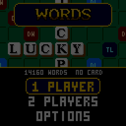

> RPGame 0.3 port: RP2350 RISC-V. Use the [project setup](../../README.md) for builds, wiring and SD packages. The upstream notes below retain CH32 sizes, timings and tool commands as historical context.

# CHWords

Lay ivory tiles on the classic fifteen-by-fifteen crossword board and outscore the house, with a camera that plays close up and whips out to the whole board. It is a table in the casino of [CHBlackjack](../CHBlackjack): TRIPLE! shakes the felt and BINGO! goes off in the rainbow.

## Controls

| Button | On the board | At the rack |
|---|---|---|
| D-pad | Move over the squares | LEFT / RIGHT: choose a tile. UP: turn the word across or down. DOWN: shuffle the rack |
| A | On an empty square: go to the rack. On a tile you laid: take it back | Lay the tile and move on to the next square |
| B | Tap: take your last tile back. Hold: see the whole board | Back to the board |
| START | The menu: PLAY, SWAP TILES, PASS, SAVE+QUIT | The same |
| SELECT | A hint: the best play the built-in list has, laid out for you | |

In the menus the D-pad moves, A selects and B goes back.

## Rules

- The first word crosses the centre star. Every later play joins the tiles already down, with all its tiles in one row or column, and every word it makes, across and down, must be a word.
- Letters score their face value, doubled or tripled on the blue squares (DL, TL). The red squares (DW, TW) double and triple the whole word. A premium square counts once, for the play that covers it.
- All seven tiles in one play earn 50 more. A blank stands for any letter and scores nothing.
- A word that is not in the list is refused: the tiles shake and stay where they are for you to change, at no cost.
- The game ends when the bag is empty and someone plays their last tile (they collect what is left on the other rack), or after six turns in a row without a score.

## How to play

**Laying a word.** Move to the square where the word starts and press A, choose a tile and press A again: it lands and the cursor moves on to the next empty square, so a word is A, A, A. Beside the rack is what the tiles so far would score, or `--` while they do not make a legal play. START, then A on PLAY, plays it.

**1 PLAYER** is against one of three opponents:

| Opponent | How it plays |
|---|---|
| TOURIST | Short words, and it knows about a third of them |
| REGULAR | Knows most words, up to seven letters |
| HIGH ROLLER | Every word in the list, the highest score, and it holds on to a blank or an S until they are worth playing |

**2 PLAYERS** pass the handheld, and the game changes hands behind a curtain.

**Which words count.** 14,160 words are built into the game: every two- and three-letter word, the most common longer ones (up to eight letters) and their plain endings. Copy [`sdcard/WORDS.DIC`](sdcard) to the top level of a FAT32 or FAT16 microSD card and every play is checked against all 168,551 words of the ENABLE list instead; the title screen says which it found. The CPU and the hint only use the built-in list. Two players without a card can agree to ALLOW a word the built-in list has not got.

Your record against each opponent, your best game and your best single play are kept (hold SELECT on the opponent screen to clear the record). OPTIONS has sound, the colour of the felt, and WORDS. Options, records and a game in progress (SAVE+QUIT, then CONTINUE) are saved.

To put it on the handheld: in the Arduino IDE, with the CHGame board package installed ([Installing](https://github.com/bateske/CHGame#installing)), open it from *File > Examples > CHGame > Games*, set *Tools > USB* to **Upload only** and upload; from a clone of the repository, `chgame upload` in this folder. On a card for the game menu it is in the release's SD card zip.

## Developer notes

- **A dictionary at three quarters of a byte a word.** `FlashDict.cpp` decodes a list that `tools/dict/build_dict.py` front-codes, Huffman-codes by the letter before, and folds with 24 suffix rules, so 14,160 words are 4,535 entries.
- **A CPU that scans instead of walking a graph.** `Ai.cpp` reads the whole list twice a turn, first for the letters that fit each square's cross-word, then for every word everywhere it could go, a slice per tick so the screen keeps moving.
- **The SD card between frames.** `Dict.cpp` looks a word up with one 512-byte block read from a hash table on the card, with no index in RAM, through the CHSd library (`<Fat.h>`), which borrows the display's SPI after `gfx_wait()` and hands it back.
- **Tiles drawn, not stored.** `Stage.cpp` draws the board and its tiles at any square size from 8 to 16 pixels, which is what lets the camera whip between them; the serif letters in `Tiles.cpp` are anti-aliased with one in-between tone.
- More in [NOTES.md](NOTES.md): design decisions, the dictionary tools, tests, the script commands and open items.

## Credits

Apache License 2.0; see `LICENSE` and `NOTICE`, which also has the MIT-licensed parts and the word list's credits.

- From [CHBlackjack](../CHBlackjack) (Apache-2.0), by way of CHChess and CHBackgammon: the shared core, the simulator and tools; CHBackgammon's display font and CHChess's pointing glove. CHBlackjack is a derivative of "Blackjack" for the Arduboy by Press Play On Tape (Apache-2.0); the 3x5 pixel font is Press Play On Tape's.
- The tiles' letters (from CHCrossword's) are rasterized from DejaVu Serif Bold and Serif Condensed Bold: Bitstream Vera Fonts Copyright (c) 2003 Bitstream, Inc.; DejaVu changes are in the public domain.
- The SD card reader is CHSd, shared with CHCrossword and CHWordWheel: HypeRunner's SPI-mode driver and FAT reader, MIT License, Copyright (c) 2026 bateske.
- The words are from the ENABLE word list (Enhanced North American Benchmark Lexicon) by Alan Beale and M. Cooper, which its authors placed in the public domain.
- Which words are built in was decided by how often each appears in print, from Peter Norvig's list of common words, compiled from the Google Books Ngrams data (Google, Creative Commons Attribution 3.0 Unported).
