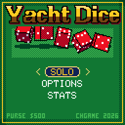

> RPGame 0.3 port: RP2350 RISC-V. Use the [project setup](../../README.md) for builds, wiring and SD packages. The upstream notes below retain CH32 sizes, timings and tool commands as historical context.

# CHYacht: Yacht Dice

Shake five dice, throw them down a wooden tray, hold the ones you like and roll the rest again: three rolls a turn, thirteen boxes to fill. It is the classic five-dice score-card game, played for chips in the CHGame casino.

## Controls

| Button | Action |
|---|---|
| A (hold, then let go) | On ROLL: shake the dice, then throw them |
| B | While shaking: put the dice back down. In the air: skip the tumble. In the tray: go to the card |
| LEFT / RIGHT | In the tray: pick a die. On the title: pick the mode |
| A | In the tray: hold or release the die. On the card: score the box (twice for a box that would score 0) |
| DOWN / UP | From the tray: DOWN goes to ROLL, UP to the card, onto the best-scoring box |
| D-pad | On the card: move between boxes |
| SELECT | Look at the next seat's card |
| START | Pause: options, sound, SAVE & QUIT |

## Rules

Each turn is up to three rolls. Held dice sit the next roll out. Then the dice must go in one open box; after thirteen turns the card is full.

| Box | Scores |
|---|---|
| Ones ... Sixes | The sum of that face. 63 or more over the six boxes earns **35** |
| 3 of a kind, 4 of a kind | All five dice |
| Full house | 25 |
| Small straight (four in a row) | 30 |
| Large straight (five in a row) | 40 |
| Yacht (five of a kind) | 50 |
| Chance | All five dice |

A second yacht, with 50 already in the yacht box, earns **100** more and is a joker: it must go in its own upper box if that is open, otherwise in any open lower box (where it counts as a full house or either straight), otherwise anywhere.

## How to play

Pick one of three games with LEFT / RIGHT on the title:

- **SOLO**: ante up and chase a score. The final score pays:

  | Score | 260+ | 300+ | 350+ | 400+ | 500+ |
  |---|---|---|---|---|---|
  | Pays (antes) | 1 | 2 | 3 | 5 | 10 |

- **VS DEALER**: you and the house take turns on a card each. The higher total takes the pot; a tie returns the ante.
- **PARTY 2P-4P**: pass the handheld round. No money, a colour of dice each.

In the staked games a **YACHT** (five of a kind in the yacht box, or a bonus yacht) pays the ante again on the spot, and reaching the **upper bonus** pays a fifth of it. The ante is $5, $25 or $100 (OPTIONS). The purse starts at $500 and is saved with the game. Open boxes on the card show what the dice on the table would score.

To put it on the handheld: in the Arduino IDE, with the CHGame board package installed ([Installing](https://github.com/bateske/CHGame#installing)), open it from *File > Examples > CHGame > Games*, set *Tools > USB* to **Upload only** and upload; from a clone of the repository, `chgame upload` in this folder. On a card for the game menu it is in the release's SD card zip.

## Developer notes

- **The roll never comes from the physics.** `Yacht.cpp` rolls the dice. The dice cam then simulates the whole throw ahead (`Dice3D.cpp`), sees which face of each die will land on top, and repaints the pips at the back wall so the tumble ends on the rolled numbers.
- **Five 3D dice.** `Dice3D.cpp` and `Cam.cpp` are CHCraps's dice and camera grown from two dice to five. Held dice are out of the simulation and wait on a plate in the corner of the screen.
- **A computer player spread over frames.** `ai::step()` in `Yacht.cpp` looks one roll ahead over all 32 ways to hold, a few holds per call while the dealer "shakes", valuing each outcome by its best box against that box's par. The solo paytable is set against its scores (`tools/tests/test_yacht.cpp` prints the figures).
- **Band redraw.** In `Screens.cpp` the seats and card, the tray and the bar are repainted only when what they show changes; only the dice cam repaints the whole screen every frame.
- **A small save record.** `Save.cpp` says only what the record holds; the CHGame library's `chgame/Save.h` does the flash pages.
- More in [NOTES.md](NOTES.md): design decisions, tests, the script commands and open items.

## Credits

Apache License 2.0; see `LICENSE` and `NOTICE`. The dealer and the 3x5 font are from "Blackjack" for the Arduboy by Press Play On Tape - Simon Holmes (filmote) and Stephane C (vampirics) - Apache-2.0, by way of CHBlackjack. The 3D dice and the dice cam come from CHCraps; the input, palette, effects, saving, sound and debug code from CHBlackjack, CHChess and CHCraps, all by the same author.
